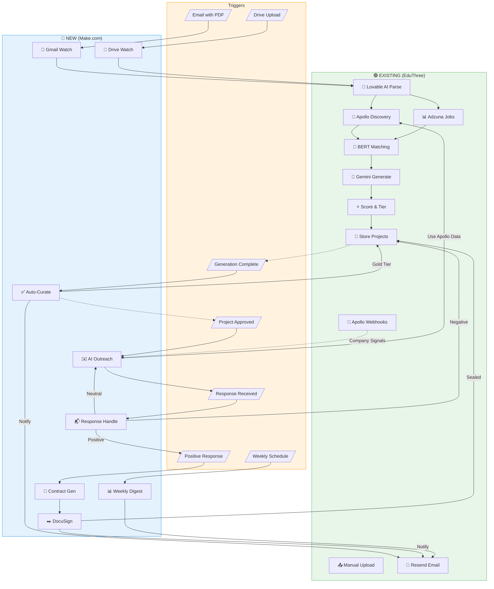

# EduThree + Make.com Automation Workflow Report (v2)

## Executive Summary

This report analyzes how **Make.com** can extend **EduThree's existing automation** to close the remaining manual gaps in the syllabus-to-sealed-project workflow. EduThree already has robust AI, Apollo.io, and Adzuna integrations - Make.com adds the **orchestration layer** for outreach, contracts, and multi-channel triggers.

**Estimated cost: $15-25 per professor/month for 10 sealed projects**

---

## Part 1: What EduThree Already Does (Current State)

### Existing Automation Stack

```
┌─────────────────────────────────────────────────────────────────────────────────┐
│                    EDUTHREE CURRENT AUTOMATION (ALREADY BUILT)                  │
├─────────────────────────────────────────────────────────────────────────────────┤
│                                                                                 │
│  ┌─────────────────────────────────────────────────────────────────────────┐   │
│  │                        AI LAYER (Lovable/Gemini 2.5-Flash)              │   │
│  ├─────────────────────────────────────────────────────────────────────────┤   │
│  │  ✅ parse-syllabus        → Extract outcomes, title, schedule from PDF  │   │
│  │  ✅ generate-projects     → AI project proposals with tasks/deliverables│   │
│  │  ✅ alignment-service     → LO alignment scoring (0-1)                  │   │
│  │  ✅ analyze-project-value → Stakeholder value narratives                │   │
│  │  ✅ competency-extractor  → Extract skills from completed projects      │   │
│  └─────────────────────────────────────────────────────────────────────────┘   │
│                                                                                 │
│  ┌─────────────────────────────────────────────────────────────────────────┐   │
│  │                        DATA LAYER (Apollo.io + Adzuna)                  │   │
│  ├─────────────────────────────────────────────────────────────────────────┤   │
│  │  ✅ Apollo company search      → Location, industry, tech stack filter  │   │
│  │  ✅ Apollo contact enrichment  → Emails, phones, titles, LinkedIn       │   │
│  │  ✅ Apollo job postings        → Active hiring signals                  │   │
│  │  ✅ Apollo webhook listener    → Funding, hiring, tech change signals   │   │
│  │  ✅ Adzuna job discovery       → Free tier job aggregation              │   │
│  │  ✅ Semantic matching (BERT)   → Cosine similarity company ranking      │   │
│  └─────────────────────────────────────────────────────────────────────────┘   │
│                                                                                 │
│  ┌─────────────────────────────────────────────────────────────────────────┐   │
│  │                        PROCESSING LAYER                                 │   │
│  ├─────────────────────────────────────────────────────────────────────────┤   │
│  │  ✅ process-generation-queue  → Async project generation (pg_cron)      │   │
│  │  ✅ aggregate-demand-signals  → Market demand aggregation               │   │
│  │  ✅ project-suitability-scorer → Project-company fit scoring            │   │
│  │  ✅ data-enrichment-pipeline  → Geocoding + Apollo enrichment           │   │
│  └─────────────────────────────────────────────────────────────────────────┘   │
│                                                                                 │
│  ┌─────────────────────────────────────────────────────────────────────────┐   │
│  │                        EMAIL/NOTIFICATION LAYER                         │   │
│  ├─────────────────────────────────────────────────────────────────────────┤   │
│  │  ✅ send-faculty-approval-email → Resend: Faculty access approval       │   │
│  │  ✅ TEST-talent-alert           → Resend: Student-to-employer alerts    │   │
│  │  ✅ submit-employer-interest    → Capture employer project interest     │   │
│  └─────────────────────────────────────────────────────────────────────────┘   │
│                                                                                 │
└─────────────────────────────────────────────────────────────────────────────────┘
```

### Current Workflow (What's Automated vs Manual)

| Step | Current State | Tool |
|------|---------------|------|
| 1. Syllabus Upload | ⚠️ **Manual** (UI only) | - |
| 2. PDF Parsing | ✅ Automated | Lovable AI |
| 3. Location Detection | ✅ Automated | detect-location |
| 4. Skill Extraction | ✅ Automated | skill-extraction-service |
| 5. Company Discovery | ✅ Automated | Apollo + Adzuna |
| 6. Semantic Matching | ✅ Automated | BERT embeddings |
| 7. Project Generation | ✅ Automated | Gemini 2.5-Flash |
| 8. LO Alignment Scoring | ✅ Automated | alignment-service |
| 9. Tier Assignment | ✅ Automated | Gold/Silver/Bronze |
| 10. Faculty Curation | ⚠️ **Manual** | UI review |
| 11. Company Outreach | ❌ **Manual** | No automation |
| 12. Response Handling | ❌ **Manual** | No automation |
| 13. Contract Generation | ❌ **Not Built** | - |
| 14. E-Signature | ❌ **Not Built** | - |
| 15. Sealed Confirmation | ❌ **Manual** | - |

---

## Part 2: The Gaps Make.com Will Fill

### Gap Analysis

```
┌─────────────────────────────────────────────────────────────────────────────────┐
│                        MANUAL GAPS (MAKE.COM OPPORTUNITIES)                     │
├─────────────────────────────────────────────────────────────────────────────────┤
│                                                                                 │
│  GAP 1: MULTI-CHANNEL SYLLABUS INTAKE                                          │
│  ════════════════════════════════════                                          │
│  Current: Faculty must manually upload via web UI                              │
│  Gap:     No email-to-upload, no LMS integration, no batch upload              │
│  Make.com: Watch Gmail/Drive/Canvas → Auto-trigger syllabus processing         │
│                                                                                 │
│  GAP 2: AUTO-CURATION OF GOLD-TIER PROJECTS                                    │
│  ════════════════════════════════════════════                                  │
│  Current: All projects require manual faculty review                           │
│  Gap:     Gold tier (≥0.80 score) could auto-publish                           │
│  Make.com: Filter by tier → Auto-approve → Notify faculty                      │
│                                                                                 │
│  GAP 3: AUTOMATED COMPANY OUTREACH                                             │
│  ═════════════════════════════════════                                         │
│  Current: Contact data exists but no outreach automation                       │
│  Gap:     Must manually email each company contact                             │
│  Make.com: AI draft email → Send via Gmail → Track opens → Follow-up           │
│                                                                                 │
│  GAP 4: RESPONSE HANDLING & CRM                                                │
│  ═════════════════════════════════                                             │
│  Current: employer_interest_submissions table captures interest                │
│  Gap:     No automated response, no routing, no follow-up                      │
│  Make.com: Watch inbox → Classify response → Route to workflow                 │
│                                                                                 │
│  GAP 5: CONTRACT GENERATION & E-SIGNATURE                                      │
│  ═════════════════════════════════════════                                     │
│  Current: No contract system                                                   │
│  Gap:     Must manually create/send partnership agreements                     │
│  Make.com: Generate PDF → DocuSign → Track status → Update DB                  │
│                                                                                 │
│  GAP 6: FACULTY NOTIFICATIONS & DIGESTS                                        │
│  ═════════════════════════════════════════                                     │
│  Current: Only faculty approval email exists                                   │
│  Gap:     No digest of matched companies, no pipeline updates                  │
│  Make.com: Daily/weekly digest → Company interest alerts → Status updates      │
│                                                                                 │
│  GAP 7: CREDIT/RATE LIMIT MONITORING                                           │
│  ══════════════════════════════════════                                        │
│  Current: Credits tracked but no alerts                                        │
│  Gap:     No warning when Apollo/Adzuna limits approach                        │
│  Make.com: Monitor usage → Alert at 80% → Suggest optimization                 │
│                                                                                 │
└─────────────────────────────────────────────────────────────────────────────────┘
```

---

## Part 3: Make.com Architecture (Building on Existing)

### High-Level Integration Architecture

```
┌─────────────────────────────────────────────────────────────────────────────────────────┐
│                     MAKE.COM LAYER (ORCHESTRATION ON TOP OF EDUTHREE)                   │
├─────────────────────────────────────────────────────────────────────────────────────────┤
│                                                                                         │
│                              ┌─────────────────────┐                                    │
│                              │    MAKE.COM         │                                    │
│                              │   ORCHESTRATOR      │                                    │
│                              └──────────┬──────────┘                                    │
│                                         │                                               │
│        ┌────────────────────────────────┼────────────────────────────────┐              │
│        │                                │                                │              │
│        ▼                                ▼                                ▼              │
│  ┌───────────────┐              ┌───────────────┐              ┌───────────────┐       │
│  │   TRIGGERS    │              │   ACTIONS     │              │   OUTPUTS     │       │
│  ├───────────────┤              ├───────────────┤              ├───────────────┤       │
│  │ Gmail Watch   │              │ EduThree API  │              │ Gmail Send    │       │
│  │ Drive Watch   │              │ (Supabase)    │              │ DocuSign      │       │
│  │ Webhook (API) │              │ OpenAI GPT-4  │              │ Slack         │       │
│  │ Schedule      │              │ PDF.co        │              │ Airtable      │       │
│  │ Form Submit   │              │ Data Store    │              │ Notion        │       │
│  └───────────────┘              └───────────────┘              └───────────────┘       │
│                                                                                         │
│  ════════════════════════════════════════════════════════════════════════════════════  │
│                                                                                         │
│  ┌───────────────────────────────────────────────────────────────────────────────────┐ │
│  │                           EDUTHREE (EXISTING BACKEND)                             │ │
│  ├───────────────────────────────────────────────────────────────────────────────────┤ │
│  │                                                                                   │ │
│  │  ┌─────────────┐  ┌─────────────┐  ┌─────────────┐  ┌─────────────┐              │ │
│  │  │ Supabase    │  │ Edge        │  │ Apollo.io   │  │ Lovable AI  │              │ │
│  │  │ PostgreSQL  │  │ Functions   │  │ (Company)   │  │ (Gemini)    │              │ │
│  │  │             │  │             │  │             │  │             │              │ │
│  │  │ • courses   │  │ • parse     │  │ • search    │  │ • generate  │              │ │
│  │  │ • projects  │  │ • discover  │  │ • enrich    │  │ • align     │              │ │
│  │  │ • companies │  │ • generate  │  │ • webhooks  │  │ • parse     │              │ │
│  │  │ • signals   │  │ • queue     │  │ • jobs      │  │ • value     │              │ │
│  │  └─────────────┘  └─────────────┘  └─────────────┘  └─────────────┘              │ │
│  │                                                                                   │ │
│  └───────────────────────────────────────────────────────────────────────────────────┘ │
│                                                                                         │
└─────────────────────────────────────────────────────────────────────────────────────────┘
```

---

## Part 4: Make.com Scenarios (Detailed)

### Scenario 1: Multi-Channel Syllabus Intake

**Purpose**: Allow syllabi from email, Drive, or Dropbox to auto-trigger EduThree processing

```
┌─────────────────────────────────────────────────────────────────────────┐
│              SCENARIO 1: SYLLABUS INTAKE (NEW CAPABILITY)               │
├─────────────────────────────────────────────────────────────────────────┤
│                                                                         │
│  TRIGGERS (Choose One or All):                                          │
│  ─────────────────────────────                                          │
│  ┌─────────────┐  ┌─────────────┐  ┌─────────────┐                      │
│  │ Gmail       │  │ Google      │  │ Dropbox     │                      │
│  │ "Syllabus"  │  │ Drive       │  │ Folder      │                      │
│  │ Subject     │  │ New File    │  │ Watch       │                      │
│  └──────┬──────┘  └──────┬──────┘  └──────┬──────┘                      │
│         │                │                │                              │
│         └────────────────┼────────────────┘                              │
│                          ▼                                               │
│  ┌─────────────────────────────────────────────────────────────────┐    │
│  │  MODULE 1: Extract PDF                                          │    │
│  │  ├─ Download attachment                                         │    │
│  │  ├─ Validate file type (PDF only)                               │    │
│  │  └─ Extract sender email → identify professor                   │    │
│  └─────────────────────────────────────────────────────────────────┘    │
│                          │                                               │
│                          ▼                                               │
│  ┌─────────────────────────────────────────────────────────────────┐    │
│  │  MODULE 2: Upload to EduThree                                   │    │
│  │  ├─ HTTP POST: Supabase Storage (upload PDF)                    │    │
│  │  ├─ HTTP POST: Insert course_profiles record                    │    │
│  │  └─ Invoke: parse-syllabus edge function                        │    │
│  │                                                                 │    │
│  │  NOTE: Leverages EXISTING parse-syllabus (Lovable AI)           │    │
│  └─────────────────────────────────────────────────────────────────┘    │
│                          │                                               │
│                          ▼                                               │
│  ┌─────────────────────────────────────────────────────────────────┐    │
│  │  MODULE 3: Trigger Generation                                   │    │
│  │  ├─ HTTP POST: Invoke discover-companies                        │    │
│  │  └─ Wait for webhook: generation_complete                       │    │
│  │                                                                 │    │
│  │  NOTE: Uses EXISTING Apollo + Adzuna discovery                  │    │
│  └─────────────────────────────────────────────────────────────────┘    │
│                          │                                               │
│                          ▼                                               │
│  ┌─────────────────────────────────────────────────────────────────┐    │
│  │  MODULE 4: Notify Faculty                                       │    │
│  │  ├─ Gmail: "Your syllabus has been processed"                   │    │
│  │  └─ Include: Link to review projects                            │    │
│  └─────────────────────────────────────────────────────────────────┘    │
│                                                                         │
│  Operations: 5-7 | AI Cost: $0 (uses existing) | Time: 30 sec          │
└─────────────────────────────────────────────────────────────────────────┘
```

### Scenario 2: Auto-Curation of Gold-Tier Projects

**Purpose**: Automatically approve high-scoring projects, notify faculty

```
┌─────────────────────────────────────────────────────────────────────────┐
│            SCENARIO 2: AUTO-CURATION (NEW CAPABILITY)                   │
├─────────────────────────────────────────────────────────────────────────┤
│                                                                         │
│  TRIGGER: Webhook from EduThree (project generation complete)           │
│  ─────────────────────────────────────────────────────────────          │
│                                                                         │
│  ┌─────────────────────────────────────────────────────────────────┐    │
│  │  MODULE 1: Fetch Generated Projects                             │    │
│  │  ├─ HTTP GET: /rest/v1/projects?generation_run_id=eq.{id}       │    │
│  │  └─ Returns: Array of projects with final_score, tier           │    │
│  └─────────────────────────────────────────────────────────────────┘    │
│                          │                                               │
│                          ▼                                               │
│  ┌─────────────────────────────────────────────────────────────────┐    │
│  │  MODULE 2: Filter by Tier                                       │    │
│  │                                                                 │    │
│  │  ┌───────────────────┐      ┌───────────────────┐               │    │
│  │  │     GOLD TIER     │      │  SILVER/BRONZE    │               │    │
│  │  │   final_score     │      │   final_score     │               │    │
│  │  │     ≥ 0.80        │      │     < 0.80        │               │    │
│  │  └─────────┬─────────┘      └─────────┬─────────┘               │    │
│  │            │                          │                         │    │
│  │            ▼                          ▼                         │    │
│  │  ┌─────────────────┐       ┌─────────────────┐                  │    │
│  │  │  AUTO-APPROVE   │       │  QUEUE FOR      │                  │    │
│  │  │  HTTP PATCH:    │       │  MANUAL REVIEW  │                  │    │
│  │  │  status =       │       │  (No action)    │                  │    │
│  │  │  'curated_live' │       │                 │                  │    │
│  │  └─────────────────┘       └─────────────────┘                  │    │
│  │                                                                 │    │
│  └─────────────────────────────────────────────────────────────────┘    │
│                          │                                               │
│                          ▼                                               │
│  ┌─────────────────────────────────────────────────────────────────┐    │
│  │  MODULE 3: Notify Faculty (via EXISTING Resend)                 │    │
│  │  ├─ HTTP POST: invoke send-faculty-email edge function          │    │
│  │  ├─ Content: "10 projects generated:                            │    │
│  │  │            4 Gold (auto-approved), 6 need review"            │    │
│  │  └─ Include: Dashboard link                                     │    │
│  └─────────────────────────────────────────────────────────────────┘    │
│                                                                         │
│  Operations: 8-12 | AI Cost: $0 | Time: 15 sec                         │
└─────────────────────────────────────────────────────────────────────────┘
```

### Scenario 3: Automated Company Outreach

**Purpose**: Send AI-generated outreach emails to company contacts (from Apollo data)

```
┌─────────────────────────────────────────────────────────────────────────┐
│           SCENARIO 3: COMPANY OUTREACH (NEW CAPABILITY)                 │
├─────────────────────────────────────────────────────────────────────────┤
│                                                                         │
│  TRIGGER: Schedule (daily) OR Webhook (project approved)                │
│  ───────────────────────────────────────────────────────                │
│                                                                         │
│  ┌─────────────────────────────────────────────────────────────────┐    │
│  │  MODULE 1: Get Approved Projects Pending Outreach               │    │
│  │  ├─ HTTP GET: /rest/v1/projects?status=eq.curated_live          │    │
│  │  │            &outreach_sent_at=is.null                         │    │
│  │  ├─ JOIN: company_profiles (contact_email, contact_first_name)  │    │
│  │  └─ Returns: Projects with company contact info (from Apollo)   │    │
│  └─────────────────────────────────────────────────────────────────┘    │
│                          │                                               │
│                          ▼                                               │
│  ┌─────────────────────────────────────────────────────────────────┐    │
│  │  MODULE 2: Iterator (Per Project)                               │    │
│  │  FOR EACH project:                                              │    │
│  │                                                                 │    │
│  │  ┌───────────────────────────────────────────────────────────┐  │    │
│  │  │  2a. AI Email Generation (OpenAI GPT-4)                   │  │    │
│  │  │  ├─ Context from EduThree:                                │  │    │
│  │  │  │   • Company: {name}, {sector}, {employee_count}        │  │    │
│  │  │  │   • Contact: {first_name}, {title}                     │  │    │
│  │  │  │   • Job Postings: {recent_postings} (from Apollo)      │  │    │
│  │  │  │   • Project: {title}, {description}, {deliverables}    │  │    │
│  │  │  │   • Course: {title}, {university}, {professor}         │  │    │
│  │  │  │                                                        │  │    │
│  │  │  ├─ Prompt: "Draft a professional outreach email..."      │  │    │
│  │  │  │   - Mention their job postings (relevance)             │  │    │
│  │  │  │   - Describe student project benefit                   │  │    │
│  │  │  │   - Include clear CTA                                  │  │    │
│  │  │  │                                                        │  │    │
│  │  │  └─ Output: Subject + Body (personalized)                 │  │    │
│  │  └───────────────────────────────────────────────────────────┘  │    │
│  │                                                                 │    │
│  │  ┌───────────────────────────────────────────────────────────┐  │    │
│  │  │  2b. Send Email (Gmail)                                   │  │    │
│  │  │  ├─ From: professor@university.edu (or system)            │  │    │
│  │  │  ├─ To: contact_email (Apollo-enriched)                   │  │    │
│  │  │  ├─ Subject: AI-generated                                 │  │    │
│  │  │  └─ Body: AI-generated + tracking pixel                   │  │    │
│  │  └───────────────────────────────────────────────────────────┘  │    │
│  │                                                                 │    │
│  │  ┌───────────────────────────────────────────────────────────┐  │    │
│  │  │  2c. Update EduThree Database                             │  │    │
│  │  │  ├─ HTTP PATCH: projects/{id}                             │  │    │
│  │  │  │   outreach_sent_at = NOW()                             │  │    │
│  │  │  │   outreach_email_subject = {subject}                   │  │    │
│  │  │  └─ Log to Data Store for follow-up scheduling            │  │    │
│  │  └───────────────────────────────────────────────────────────┘  │    │
│  │                                                                 │    │
│  └─────────────────────────────────────────────────────────────────┘    │
│                          │                                               │
│                          ▼                                               │
│  ┌─────────────────────────────────────────────────────────────────┐    │
│  │  MODULE 3: Schedule Follow-ups (Data Store)                     │    │
│  │  ├─ Day 3: If no response → Queue follow-up #1                  │    │
│  │  ├─ Day 7: If no response → Queue follow-up #2                  │    │
│  │  └─ Day 14: If no response → Mark as "cold"                     │    │
│  └─────────────────────────────────────────────────────────────────┘    │
│                                                                         │
│  Operations: 30 (10 projects × 3) | AI Cost: ~$0.15 | Time: 2 min      │
└─────────────────────────────────────────────────────────────────────────┘
```

### Scenario 4: Response Handling & Classification

**Purpose**: Automatically detect and route company responses

```
┌─────────────────────────────────────────────────────────────────────────┐
│           SCENARIO 4: RESPONSE HANDLING (NEW CAPABILITY)                │
├─────────────────────────────────────────────────────────────────────────┤
│                                                                         │
│  TRIGGER: Gmail Watch (replies to outreach emails)                      │
│  ─────────────────────────────────────────────────                      │
│                                                                         │
│  ┌─────────────────────────────────────────────────────────────────┐    │
│  │  MODULE 1: Extract Reply Details                                │    │
│  │  ├─ Parse: From email, subject (thread), body text              │    │
│  │  └─ Match: Look up project by outreach_email_subject            │    │
│  └─────────────────────────────────────────────────────────────────┘    │
│                          │                                               │
│                          ▼                                               │
│  ┌─────────────────────────────────────────────────────────────────┐    │
│  │  MODULE 2: AI Response Classification (OpenAI)                  │    │
│  │  ├─ Prompt: "Classify this email response:"                     │    │
│  │  │   - POSITIVE: Interested, wants to proceed                   │    │
│  │  │   - NEUTRAL: Questions, needs more info                      │    │
│  │  │   - NEGATIVE: Not interested, wrong contact                  │    │
│  │  │   - OOO: Out of office auto-reply                            │    │
│  │  └─ Output: { classification, confidence, summary }             │    │
│  └─────────────────────────────────────────────────────────────────┘    │
│                          │                                               │
│         ┌────────────────┼────────────────┬───────────────┐              │
│         ▼                ▼                ▼               ▼              │
│  ┌───────────┐    ┌───────────┐    ┌───────────┐  ┌───────────┐         │
│  │ POSITIVE  │    │  NEUTRAL  │    │ NEGATIVE  │  │    OOO    │         │
│  │           │    │           │    │           │  │           │         │
│  │ → Notify  │    │ → Send    │    │ → Mark    │  │ → Resched │         │
│  │   faculty │    │   more    │    │   closed  │  │   ule     │         │
│  │ → Start   │    │   info    │    │ → Remove  │  │   follow  │         │
│  │   contract│    │   email   │    │   from    │  │   up      │         │
│  │   flow    │    │           │    │   pipeline│  │           │         │
│  └───────────┘    └───────────┘    └───────────┘  └───────────┘         │
│                          │                                               │
│                          ▼                                               │
│  ┌─────────────────────────────────────────────────────────────────┐    │
│  │  MODULE 3: Update EduThree                                      │    │
│  │  ├─ HTTP PATCH: projects/{id}                                   │    │
│  │  │   response_status = {classification}                         │    │
│  │  │   response_received_at = NOW()                               │    │
│  │  └─ Insert: employer_interest_submissions (if positive)         │    │
│  └─────────────────────────────────────────────────────────────────┘    │
│                                                                         │
│  Operations: 5-8 per response | AI Cost: ~$0.02 | Time: 30 sec         │
└─────────────────────────────────────────────────────────────────────────┘
```

### Scenario 5: Contract Generation & E-Signature

**Purpose**: Generate partnership agreements and collect signatures

```
┌─────────────────────────────────────────────────────────────────────────┐
│           SCENARIO 5: CONTRACT & SEAL (NEW CAPABILITY)                  │
├─────────────────────────────────────────────────────────────────────────┤
│                                                                         │
│  TRIGGER: Webhook (response_status = 'positive')                        │
│  ───────────────────────────────────────────────                        │
│                                                                         │
│  ┌─────────────────────────────────────────────────────────────────┐    │
│  │  MODULE 1: Fetch Project & Company Data                         │    │
│  │  ├─ HTTP GET: project details (from EduThree)                   │    │
│  │  ├─ HTTP GET: company_profiles (Apollo-enriched)                │    │
│  │  └─ HTTP GET: course_profiles (professor info)                  │    │
│  └─────────────────────────────────────────────────────────────────┘    │
│                          │                                               │
│                          ▼                                               │
│  ┌─────────────────────────────────────────────────────────────────┐    │
│  │  MODULE 2: Generate Contract (PDF.co or Docmosis)               │    │
│  │  ├─ Template: Partnership Agreement                             │    │
│  │  │   • Parties: {company_name}, {university}                    │    │
│  │  │   • Project Scope: {title}, {description}, {deliverables}    │    │
│  │  │   • Timeline: {course_weeks} weeks                           │    │
│  │  │   • Team: {student_count} students                           │    │
│  │  │   • IP Rights: University retains academic use               │    │
│  │  │   • Confidentiality: Standard NDA clause                     │    │
│  │  │   • Liability: Limited liability clause                      │    │
│  │  └─ Output: PDF contract                                        │    │
│  └─────────────────────────────────────────────────────────────────┘    │
│                          │                                               │
│                          ▼                                               │
│  ┌─────────────────────────────────────────────────────────────────┐    │
│  │  MODULE 3: Send for E-Signature (DocuSign/PandaDoc)             │    │
│  │  ├─ Signers:                                                    │    │
│  │  │   1. Company Contact: {contact_email}                        │    │
│  │  │   2. Professor: {professor_email}                            │    │
│  │  │   3. Department Head: {dept_head_email} (optional)           │    │
│  │  ├─ Track: Sent → Viewed → Signed                               │    │
│  │  └─ Webhook: Notify on completion                               │    │
│  └─────────────────────────────────────────────────────────────────┘    │
│                          │                                               │
│                          ▼                                               │
│  ┌─────────────────────────────────────────────────────────────────┐    │
│  │  MODULE 4: Update Status & Notify                               │    │
│  │  ├─ On All Signed:                                              │    │
│  │  │   HTTP PATCH: projects/{id} status = 'sealed'                │    │
│  │  │   Store signed PDF in Supabase Storage                       │    │
│  │  ├─ Gmail: Send confirmation to all parties                     │    │
│  │  ├─ Slack: Post to #partnerships-wins (optional)                │    │
│  │  └─ Faculty Dashboard: Show sealed project                      │    │
│  └─────────────────────────────────────────────────────────────────┘    │
│                                                                         │
│  Operations: 15-20 | PDF Cost: ~$0.05 | DocuSign: ~$1 | Time: varies   │
└─────────────────────────────────────────────────────────────────────────┘
```

### Scenario 6: Faculty Weekly Digest

**Purpose**: Keep faculty informed with automated pipeline summaries

```
┌─────────────────────────────────────────────────────────────────────────┐
│            SCENARIO 6: FACULTY DIGEST (NEW CAPABILITY)                  │
├─────────────────────────────────────────────────────────────────────────┤
│                                                                         │
│  TRIGGER: Schedule (Monday 8am)                                         │
│  ─────────────────────────────                                          │
│                                                                         │
│  ┌─────────────────────────────────────────────────────────────────┐    │
│  │  MODULE 1: Aggregate Faculty Stats (from EduThree)              │    │
│  │  FOR EACH faculty member:                                       │    │
│  │  ├─ Total projects generated (this week)                        │    │
│  │  ├─ Gold tier count                                             │    │
│  │  ├─ Outreach sent / responses received                          │    │
│  │  ├─ Positive responses (ready for contract)                     │    │
│  │  ├─ Contracts pending / sealed                                  │    │
│  │  └─ Apollo credits used                                         │    │
│  └─────────────────────────────────────────────────────────────────┘    │
│                          │                                               │
│                          ▼                                               │
│  ┌─────────────────────────────────────────────────────────────────┐    │
│  │  MODULE 2: Generate Digest Email (OpenAI)                       │    │
│  │  ├─ Summarize stats in friendly format                          │    │
│  │  ├─ Highlight: "3 companies responded positively!"              │    │
│  │  ├─ Action items: "2 projects need your review"                 │    │
│  │  └─ Include: Dashboard link                                     │    │
│  └─────────────────────────────────────────────────────────────────┘    │
│                          │                                               │
│                          ▼                                               │
│  ┌─────────────────────────────────────────────────────────────────┐    │
│  │  MODULE 3: Send via Gmail/Resend                                │    │
│  │  ├─ To: faculty email                                           │    │
│  │  ├─ Subject: "EduThree Weekly: {count} projects, {sealed} sealed"│    │
│  │  └─ HTML: Professional digest template                          │    │
│  └─────────────────────────────────────────────────────────────────┘    │
│                                                                         │
│  Operations: 3-5 per faculty | AI Cost: ~$0.01 | Time: 10 sec          │
└─────────────────────────────────────────────────────────────────────────┘
```

---

## Part 5: Complete Workflow Diagram



---

## Part 6: Cost Analysis (Accurate)

### Operations Breakdown Per Professor (10 Projects)

| Scenario | Description | Operations | Notes |
|----------|-------------|-----------|-------|
| S1 | Syllabus Intake | 7 | 1 upload (email/drive trigger) |
| S2 | Auto-Curation | 12 | Filter 10 projects + notify |
| S3 | Company Outreach | 35 | 10 emails × 3 (AI + send + log) + follow-ups |
| S4 | Response Handling | 20 | ~5 responses × 4 modules |
| S5 | Contract & Seal | 18 | ~3 sealed × 6 modules |
| S6 | Weekly Digest | 5 | 4 weeks × 1.25 ops |
| **TOTAL** | | **~97 ops** | Per syllabus lifecycle |

### Monthly Cost Per Professor

```
┌─────────────────────────────────────────────────────────────────────┐
│          MONTHLY COST PER PROFESSOR (10 Projects)                   │
├─────────────────────────────────────────────────────────────────────┤
│                                                                     │
│  MAKE.COM PLATFORM                                                  │
│  ═════════════════                                                  │
│  Monthly operations needed: ~100 per professor                      │
│  With buffer (1.5x): ~150 operations                                │
│                                                                     │
│  Plan Allocation:                                                   │
│  ├─ Pro Plan: 40,000 ops/month = 266 professors                     │
│  ├─ Cost per professor: $16 ÷ 266 = $0.06                          │
│  └─ With overhead (shared scenarios): ~$0.50/professor              │
│                                                                     │
│  Make.com Subtotal:                                      $0.50      │
│                                                                     │
│  AI COSTS (Make.com OpenAI Module)                                  │
│  ═════════════════════════════════                                  │
│  Outreach emails: 10 × $0.015 (GPT-4 mini)         =     $0.15     │
│  Response classification: 5 × $0.01                =     $0.05     │
│  Digest generation: 4 × $0.01                      =     $0.04     │
│  ──────────────────────────────────────────────────────────────     │
│  AI Subtotal:                                            $0.24     │
│                                                                     │
│  THIRD-PARTY SERVICES                                               │
│  ════════════════════                                               │
│  PDF.co (contract gen): 3 × $0.05                  =     $0.15     │
│  DocuSign (per envelope): 3 × $1.50                =     $4.50     │
│  ──────────────────────────────────────────────────────────────     │
│  Third-Party Subtotal:                                   $4.65     │
│                                                                     │
│  EXISTING EDUTHREE COSTS (Already Paid)                             │
│  ══════════════════════════════════════                             │
│  Lovable AI (Gemini): Already included                   $0.00     │
│  Apollo.io: Already subscribed                           $0.00     │
│  Adzuna: Free tier                                       $0.00     │
│  Resend: Free tier (100 emails/day)                      $0.00     │
│  Supabase: Already subscribed                            $0.00     │
│                                                                     │
│  ═══════════════════════════════════════════════════════════════    │
│  TOTAL MAKE.COM ADDITION PER PROFESSOR:               $5.39        │
│  ═══════════════════════════════════════════════════════════════    │
│                                                                     │
│  ALTERNATIVE: Without DocuSign (manual contracts)                   │
│  Make.com + AI only:                                  $0.89        │
│                                                                     │
└─────────────────────────────────────────────────────────────────────┘
```

### Scaling Costs

| Professors | Make.com Plan | DocuSign Plan | Monthly Total | Per Professor |
|------------|---------------|---------------|---------------|---------------|
| 10 | Pro ($16) | Personal ($10) | $30 | **$3.00** |
| 25 | Pro ($16) | Standard ($25) | $50 | **$2.00** |
| 50 | Teams ($29) | Business ($40) | $85 | **$1.70** |
| 100 | Teams ($29) | Enterprise ($80) | $130 | **$1.30** |

---

## Part 7: Implementation Priority

### Phase 1: Quick Wins (Week 1-2)
Build on existing infrastructure with minimal new development.

| Scenario | Effort | Impact | Dependencies |
|----------|--------|--------|--------------|
| S2: Auto-Curation | Low | High | Just filtering + DB update |
| S6: Weekly Digest | Low | Medium | Uses existing Resend |

### Phase 2: Outreach Automation (Week 3-4)
The biggest gap - company outreach.

| Scenario | Effort | Impact | Dependencies |
|----------|--------|--------|--------------|
| S3: Company Outreach | Medium | Very High | OpenAI + Gmail |
| S4: Response Handling | Medium | High | Gmail Watch |

### Phase 3: Full Automation (Week 5-6)
Contract and multi-channel intake.

| Scenario | Effort | Impact | Dependencies |
|----------|--------|--------|--------------|
| S5: Contract & Seal | High | Very High | DocuSign + PDF.co |
| S1: Multi-Channel Intake | Medium | Medium | Gmail/Drive triggers |

---

## Part 8: What Make.com Adds vs What Exists

### Summary Comparison

| Capability | EduThree (Exists) | Make.com (Adds) |
|------------|-------------------|-----------------|
| **Syllabus Parsing** | ✅ Lovable AI | — |
| **Company Discovery** | ✅ Apollo + Adzuna | — |
| **Semantic Matching** | ✅ BERT embeddings | — |
| **Project Generation** | ✅ Gemini 2.5-Flash | — |
| **LO Alignment** | ✅ alignment-service | — |
| **Faculty Approval Email** | ✅ Resend | — |
| **Talent Alerts** | ✅ TEST-talent-alert | — |
| **Employer Interest Capture** | ✅ submit-employer-interest | — |
| **Apollo Webhooks** | ✅ apollo-webhook-listener | — |
| **Queue Processing** | ✅ process-generation-queue | — |
| **Multi-Channel Intake** | ❌ | ✅ Gmail/Drive watch |
| **Auto-Curation** | ❌ | ✅ Tier filtering |
| **Company Outreach** | ❌ | ✅ AI email + send |
| **Response Handling** | ❌ | ✅ Classify + route |
| **Follow-up Sequences** | ❌ | ✅ Scheduled follow-ups |
| **Contract Generation** | ❌ | ✅ PDF.co templates |
| **E-Signature** | ❌ | ✅ DocuSign integration |
| **Faculty Digests** | ❌ | ✅ Weekly summaries |
| **Credit Monitoring** | ❌ | ✅ Usage alerts |

---

## Appendix: Make.com Module Reference

### Required Integrations

| Integration | Purpose | Make.com Module |
|-------------|---------|-----------------|
| Gmail | Trigger + Send | Gmail (Watch, Send) |
| Google Drive | Syllabus watch | Google Drive (Watch) |
| OpenAI | Email drafting, classification | OpenAI (Create Completion) |
| HTTP | EduThree API calls | HTTP (Make Request) |
| DocuSign | E-signatures | DocuSign (Create Envelope) |
| PDF.co | Contract generation | PDF.co (HTML to PDF) |
| Slack | Team notifications | Slack (Post Message) |
| Data Store | State management | Make Data Store |

### API Endpoints Needed (EduThree)

```
# Existing (can be called via HTTP module)
POST   /functions/v1/parse-syllabus
POST   /functions/v1/discover-companies
POST   /functions/v1/generate-projects
POST   /functions/v1/send-faculty-approval-email

# New endpoints to add for Make.com integration
GET    /rest/v1/projects?generation_run_id=eq.{id}
PATCH  /rest/v1/projects?id=eq.{id}
POST   /rest/v1/outreach_logs
GET    /rest/v1/company_profiles?id=eq.{id}
```

---

*Report updated: December 2024*
*Version 2.0 - Accurate analysis based on codebase review*
