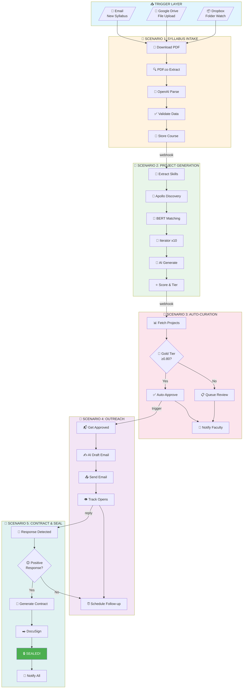

# EduThree + Make.com Automation Workflow Report

## Executive Summary

This report outlines how **Make.com** can be integrated with **EduThree (Projectify-Syllabus)** to create a fully automated workflow from syllabus upload to sealed industry partnerships. The proposed solution automates 10 projects per professor with an estimated **cost of $15-25 per professor per month**.

---

## Part 1: EduThree Current State Analysis

### What EduThree Does Now

```
┌─────────────────────────────────────────────────────────────────────────────┐
│                        CURRENT EDUTHREE WORKFLOW                            │
├─────────────────────────────────────────────────────────────────────────────┤
│                                                                             │
│  ┌──────────────┐    ┌──────────────┐    ┌──────────────┐    ┌───────────┐ │
│  │   UPLOAD     │───▶│    PARSE     │───▶│   DISCOVER   │───▶│  GENERATE │ │
│  │   Syllabus   │    │   AI/PDF     │    │   Companies  │    │  Projects │ │
│  │   (Manual)   │    │   (Auto)     │    │   (Apollo)   │    │   (AI)    │ │
│  └──────────────┘    └──────────────┘    └──────────────┘    └───────────┘ │
│                                                       │                     │
│                                                       ▼                     │
│  ┌──────────────┐    ┌──────────────┐    ┌──────────────┐                  │
│  │   STUDENT    │◀───│   CURATE     │◀───│    SCORE     │                  │
│  │   ACCESS     │    │   (Manual)   │    │   & TIER     │                  │
│  │   (Manual)   │    │              │    │   (Auto)     │                  │
│  └──────────────┘    └──────────────┘    └──────────────┘                  │
│                                                                             │
└─────────────────────────────────────────────────────────────────────────────┘
```

#### Current Capabilities:
| Phase | Feature | Status |
|-------|---------|--------|
| 1. Upload | PDF syllabus upload | ✅ Manual |
| 2. Parse | AI extraction of learning outcomes | ✅ Automated |
| 3. Discover | Apollo.io company search & enrichment | ✅ Automated |
| 4. Match | BERT semantic similarity scoring | ✅ Automated |
| 5. Generate | AI project proposal creation | ✅ Automated |
| 6. Score | LO alignment, feasibility, benefit scoring | ✅ Automated |
| 7. Curate | Faculty review & approval | ❌ Manual |
| 8. Outreach | Company contact | ❌ Manual |
| 9. Contract | Partnership agreement | ❌ Manual |
| 10. Seal | Final project confirmation | ❌ Manual |

### What EduThree Can Do Next

| Enhancement | Description | Impact |
|-------------|-------------|--------|
| **Auto-Publish** | Gold-tier projects auto-approved | Save 2-3 hrs/course |
| **Batch Upload** | Multiple syllabi at once | 5x faster onboarding |
| **Template Reuse** | Clone successful projects | 50% faster generation |
| **Smart Outreach** | Automated email generation | Scale partnerships |
| **Contract Generation** | Auto-generate agreements | Legal automation |
| **E-Signature** | Digital contract signing | Instant sealing |
| **Analytics** | Success tracking dashboard | Data-driven improvements |

---

## Part 2: Make.com Integration Strategy

### Make.com AI Integrations Available

Based on [Make.com's AI automation capabilities](https://www.make.com/en/ai-automation):

| Integration | Use Case in EduThree |
|-------------|---------------------|
| **OpenAI (GPT-4)** | Project proposal enhancement, email drafting |
| **Claude AI** | Document analysis, quality review |
| **Google Vertex AI** | Semantic matching enhancement |
| **PDF.co** | Syllabus parsing, contract generation |
| **DocsParse** | Intelligent document extraction |
| **Mistral AI** | Cost-effective text processing |

---

## Part 3: Automated Workflow Design

### Complete Make.com Automation Architecture

```
┌─────────────────────────────────────────────────────────────────────────────────────────┐
│                    MAKE.COM AUTOMATED WORKFLOW: SYLLABUS TO SEALED PROJECT              │
├─────────────────────────────────────────────────────────────────────────────────────────┤
│                                                                                         │
│  TRIGGER LAYER                                                                          │
│  ═══════════════                                                                        │
│  ┌─────────────────┐     ┌─────────────────┐     ┌─────────────────┐                   │
│  │  Email Watch    │     │  Google Drive   │     │  Dropbox Watch  │                   │
│  │  (New Syllabus) │     │  (Folder Watch) │     │  (Upload Hook)  │                   │
│  └────────┬────────┘     └────────┬────────┘     └────────┬────────┘                   │
│           │                       │                       │                             │
│           └───────────────────────┼───────────────────────┘                             │
│                                   ▼                                                     │
│  ┌─────────────────────────────────────────────────────────────────────────────────┐   │
│  │                          SCENARIO 1: SYLLABUS INTAKE                            │   │
│  │  ┌──────────┐   ┌──────────┐   ┌──────────┐   ┌──────────┐   ┌──────────┐      │   │
│  │  │ Download │──▶│ PDF.co   │──▶│ OpenAI   │──▶│ Validate │──▶│ Webhook  │      │   │
│  │  │ PDF      │   │ Extract  │   │ Enhance  │   │ Data     │   │ EduThree │      │   │
│  │  │          │   │ Text     │   │ Parse    │   │          │   │ API      │      │   │
│  │  └──────────┘   └──────────┘   └──────────┘   └──────────┘   └──────────┘      │   │
│  │                                                                                 │   │
│  │  Operations: 5 per syllabus                                                     │   │
│  └─────────────────────────────────────────────────────────────────────────────────┘   │
│                                   │                                                     │
│                                   ▼                                                     │
│  ┌─────────────────────────────────────────────────────────────────────────────────┐   │
│  │                       SCENARIO 2: PROJECT GENERATION                            │   │
│  │  ┌──────────┐   ┌──────────┐   ┌──────────┐   ┌──────────┐   ┌──────────┐      │   │
│  │  │ Webhook  │──▶│ EduThree │──▶│ Iterator │──▶│ OpenAI   │──▶│ Score &  │      │   │
│  │  │ Trigger  │   │ Generate │   │ (10 Co.) │   │ Enhance  │   │ Tier     │      │   │
│  │  │          │   │ Projects │   │          │   │ Proposal │   │          │      │   │
│  │  └──────────┘   └──────────┘   └──────────┘   └──────────┘   └──────────┘      │   │
│  │                                                                                 │   │
│  │  Operations: 15 per syllabus (1 trigger + 10 iterations + 4 processing)         │   │
│  └─────────────────────────────────────────────────────────────────────────────────┘   │
│                                   │                                                     │
│                                   ▼                                                     │
│  ┌─────────────────────────────────────────────────────────────────────────────────┐   │
│  │                       SCENARIO 3: AUTO-CURATION                                 │   │
│  │  ┌──────────┐   ┌──────────┐   ┌──────────┐   ┌──────────┐                      │   │
│  │  │ Filter   │──▶│ Gold Tier│──▶│ Auto     │──▶│ Notify   │                      │   │
│  │  │ Projects │   │ Check    │   │ Approve  │   │ Faculty  │                      │   │
│  │  │          │   │ (≥0.80)  │   │          │   │ (Email)  │                      │   │
│  │  └──────────┘   └──────────┘   └──────────┘   └──────────┘                      │   │
│  │                                                                                 │   │
│  │  Operations: 12 per syllabus (filter + 10 checks + notification)                │   │
│  └─────────────────────────────────────────────────────────────────────────────────┘   │
│                                   │                                                     │
│                                   ▼                                                     │
│  ┌─────────────────────────────────────────────────────────────────────────────────┐   │
│  │                      SCENARIO 4: COMPANY OUTREACH                               │   │
│  │  ┌──────────┐   ┌──────────┐   ┌──────────┐   ┌──────────┐   ┌──────────┐      │   │
│  │  │ Get      │──▶│ OpenAI   │──▶│ Gmail/   │──▶│ Track    │──▶│ Wait for │      │   │
│  │  │ Approved │   │ Draft    │   │ Outlook  │   │ Opens    │   │ Response │      │   │
│  │  │ Projects │   │ Email    │   │ Send     │   │ (Pixel)  │   │          │      │   │
│  │  └──────────┘   └──────────┘   └──────────┘   └──────────┘   └──────────┘      │   │
│  │                                                                                 │   │
│  │  Operations: 30 per syllabus (3 emails × 10 companies)                          │   │
│  └─────────────────────────────────────────────────────────────────────────────────┘   │
│                                   │                                                     │
│                                   ▼                                                     │
│  ┌─────────────────────────────────────────────────────────────────────────────────┐   │
│  │                      SCENARIO 5: CONTRACT & SEAL                                │   │
│  │  ┌──────────┐   ┌──────────┐   ┌──────────┐   ┌──────────┐   ┌──────────┐      │   │
│  │  │ Response │──▶│ PDF      │──▶│ DocuSign │──▶│ Update   │──▶│ Notify   │      │   │
│  │  │ Webhook  │   │ Generate │   │ /Pandadoc│   │ Status   │   │ All      │      │   │
│  │  │          │   │ Contract │   │ E-Sign   │   │ "Sealed" │   │ Parties  │      │   │
│  │  └──────────┘   └──────────┘   └──────────┘   └──────────┘   └──────────┘      │   │
│  │                                                                                 │   │
│  │  Operations: 25 per sealed project (assuming 5/10 convert)                      │   │
│  └─────────────────────────────────────────────────────────────────────────────────┘   │
│                                                                                         │
│  TOTAL OPERATIONS PER PROFESSOR (10 PROJECTS):                                          │
│  ═══════════════════════════════════════════════════════════════════════════════════   │
│  Scenario 1: 5 ops × 1 syllabus        =   5 operations                                │
│  Scenario 2: 15 ops × 1 run            =  15 operations                                │
│  Scenario 3: 12 ops × 1 run            =  12 operations                                │
│  Scenario 4: 30 ops × 1 run            =  30 operations                                │
│  Scenario 5: 25 ops × 0.5 (50% conv)   =  12 operations                                │
│  ─────────────────────────────────────────────────────                                 │
│  TOTAL PER SYLLABUS:                   ~  74 operations                                │
│                                                                                         │
└─────────────────────────────────────────────────────────────────────────────────────────┘
```

---

## Part 4: Detailed Workflow Breakdown

### Scenario 1: Syllabus Intake Automation

```
┌─────────────────────────────────────────────────────────────────────┐
│                    SCENARIO 1: SYLLABUS INTAKE                      │
├─────────────────────────────────────────────────────────────────────┤
│                                                                     │
│   ┌─────────┐                                                       │
│   │ TRIGGER │  Email/Drive/Dropbox watches for new PDF              │
│   └────┬────┘                                                       │
│        │                                                            │
│        ▼                                                            │
│   ┌─────────────────────────────────────────────────────────────┐   │
│   │  MODULE 1: Download & Extract                               │   │
│   │  ├─ Download PDF attachment                                 │   │
│   │  ├─ PDF.co: Extract text with OCR                          │   │
│   │  └─ Output: Raw text content                                │   │
│   └─────────────────────────────────────────────────────────────┘   │
│        │                                                            │
│        ▼                                                            │
│   ┌─────────────────────────────────────────────────────────────┐   │
│   │  MODULE 2: AI Enhancement                                   │   │
│   │  ├─ OpenAI GPT-4: Parse structured data                    │   │
│   │  │   • Course title & level                                 │   │
│   │  │   • Duration (weeks, hrs/week)                           │   │
│   │  │   • Learning outcomes (array)                            │   │
│   │  │   • Artifacts/deliverables                               │   │
│   │  └─ Output: JSON structured syllabus                        │   │
│   └─────────────────────────────────────────────────────────────┘   │
│        │                                                            │
│        ▼                                                            │
│   ┌─────────────────────────────────────────────────────────────┐   │
│   │  MODULE 3: Validation & Storage                             │   │
│   │  ├─ Validate required fields present                        │   │
│   │  ├─ Auto-detect location from professor email               │   │
│   │  ├─ HTTP Request: POST to EduThree API                      │   │
│   │  └─ Store course_profile in Supabase                        │   │
│   └─────────────────────────────────────────────────────────────┘   │
│        │                                                            │
│        ▼                                                            │
│   ┌─────────┐                                                       │
│   │  END    │  Triggers Scenario 2 via webhook                      │
│   └─────────┘                                                       │
│                                                                     │
│   Operations: 5 | AI Cost: ~$0.02 | Time: 30 seconds               │
└─────────────────────────────────────────────────────────────────────┘
```

### Scenario 2: Project Generation

```
┌─────────────────────────────────────────────────────────────────────┐
│                  SCENARIO 2: PROJECT GENERATION                     │
├─────────────────────────────────────────────────────────────────────┤
│                                                                     │
│   ┌─────────┐                                                       │
│   │ WEBHOOK │  Triggered by Scenario 1 completion                   │
│   └────┬────┘                                                       │
│        │                                                            │
│        ▼                                                            │
│   ┌─────────────────────────────────────────────────────────────┐   │
│   │  MODULE 1: Skill Extraction                                 │   │
│   │  ├─ Map outcomes → O*NET SOC codes                          │   │
│   │  ├─ Extract skills & DWAs                                   │   │
│   │  └─ Store in generation_runs                                │   │
│   └─────────────────────────────────────────────────────────────┘   │
│        │                                                            │
│        ▼                                                            │
│   ┌─────────────────────────────────────────────────────────────┐   │
│   │  MODULE 2: Company Discovery                                │   │
│   │  ├─ HTTP: Apollo.io API search                              │   │
│   │  │   • Location: from course profile                        │   │
│   │  │   • Industry: from skills mapping                        │   │
│   │  │   • Size: 100+ employees                                 │   │
│   │  ├─ Enrich: contacts, job postings, technologies            │   │
│   │  └─ Return: 10-15 candidate companies                       │   │
│   └─────────────────────────────────────────────────────────────┘   │
│        │                                                            │
│        ▼                                                            │
│   ┌─────────────────────────────────────────────────────────────┐   │
│   │  MODULE 3: Semantic Matching (BERT)                         │   │
│   │  ├─ Generate embeddings for skills                          │   │
│   │  ├─ Generate embeddings for company profiles                │   │
│   │  ├─ Calculate cosine similarity                             │   │
│   │  ├─ Apply industry penalties                                │   │
│   │  └─ Filter: similarity ≥ 50%                                │   │
│   └─────────────────────────────────────────────────────────────┘   │
│        │                                                            │
│        ▼                                                            │
│   ┌─────────────────────────────────────────────────────────────┐   │
│   │  MODULE 4: Iterator (10 Companies)                          │   │
│   │  FOR EACH matched company:                                  │   │
│   │  ├─ OpenAI: Generate project proposal                       │   │
│   │  │   • Title & description                                  │   │
│   │  │   • 5-7 tasks                                            │   │
│   │  │   • 4-6 deliverables                                     │   │
│   │  │   • Budget estimate                                      │   │
│   │  ├─ Calculate scores:                                       │   │
│   │  │   • LO Alignment (50%)                                   │   │
│   │  │   • Feasibility (30%)                                    │   │
│   │  │   • Mutual Benefit (20%)                                 │   │
│   │  ├─ Assign tier (Gold/Silver/Bronze)                        │   │
│   │  └─ Store project in database                               │   │
│   └─────────────────────────────────────────────────────────────┘   │
│        │                                                            │
│        ▼                                                            │
│   ┌─────────┐                                                       │
│   │  END    │  Triggers Scenario 3                                  │
│   └─────────┘                                                       │
│                                                                     │
│   Operations: 15 | AI Cost: ~$0.15 | Time: 2-3 minutes             │
└─────────────────────────────────────────────────────────────────────┘
```

### Scenario 3: Auto-Curation

```
┌─────────────────────────────────────────────────────────────────────┐
│                    SCENARIO 3: AUTO-CURATION                        │
├─────────────────────────────────────────────────────────────────────┤
│                                                                     │
│   ┌─────────┐                                                       │
│   │ WEBHOOK │  Triggered when projects generated                    │
│   └────┬────┘                                                       │
│        │                                                            │
│        ▼                                                            │
│   ┌─────────────────────────────────────────────────────────────┐   │
│   │  MODULE 1: Fetch Generated Projects                         │   │
│   │  ├─ HTTP: GET /projects?generation_run_id=xxx               │   │
│   │  └─ Returns: Array of 10 projects with scores               │   │
│   └─────────────────────────────────────────────────────────────┘   │
│        │                                                            │
│        ▼                                                            │
│   ┌─────────────────────────────────────────────────────────────┐   │
│   │  MODULE 2: Filter & Route                                   │   │
│   │                                                             │   │
│   │  ┌─────────────────┐   ┌─────────────────┐                  │   │
│   │  │   GOLD TIER     │   │  SILVER/BRONZE  │                  │   │
│   │  │   (≥0.80)       │   │    (<0.80)      │                  │   │
│   │  │                 │   │                 │                  │   │
│   │  │  Auto-Approve   │   │  Queue for      │                  │   │
│   │  │  Status →       │   │  Manual Review  │                  │   │
│   │  │  "curated_live" │   │                 │                  │   │
│   │  └────────┬────────┘   └────────┬────────┘                  │   │
│   │           │                     │                           │   │
│   │           ▼                     ▼                           │   │
│   │  ┌─────────────────┐   ┌─────────────────┐                  │   │
│   │  │ Update DB:      │   │ Create Task in  │                  │   │
│   │  │ project.status  │   │ Notion/Asana    │                  │   │
│   │  │ = curated_live  │   │ for faculty     │                  │   │
│   │  └─────────────────┘   └─────────────────┘                  │   │
│   │                                                             │   │
│   └─────────────────────────────────────────────────────────────┘   │
│        │                                                            │
│        ▼                                                            │
│   ┌─────────────────────────────────────────────────────────────┐   │
│   │  MODULE 3: Notification                                     │   │
│   │  ├─ Gmail: Send summary to faculty                          │   │
│   │  │   "10 projects generated: 4 Gold (auto-approved),        │   │
│   │  │    6 need review"                                        │   │
│   │  ├─ Slack: Post to #projects channel (optional)             │   │
│   │  └─ Dashboard: Update real-time stats                       │   │
│   └─────────────────────────────────────────────────────────────┘   │
│        │                                                            │
│        ▼                                                            │
│   ┌─────────┐                                                       │
│   │  END    │  Approved projects trigger Scenario 4                 │
│   └─────────┘                                                       │
│                                                                     │
│   Operations: 12 | AI Cost: $0 | Time: 15 seconds                  │
└─────────────────────────────────────────────────────────────────────┘
```

### Scenario 4: Company Outreach

```
┌─────────────────────────────────────────────────────────────────────┐
│                   SCENARIO 4: COMPANY OUTREACH                      │
├─────────────────────────────────────────────────────────────────────┤
│                                                                     │
│   ┌─────────┐                                                       │
│   │ TRIGGER │  Scheduled daily OR webhook from approval             │
│   └────┬────┘                                                       │
│        │                                                            │
│        ▼                                                            │
│   ┌─────────────────────────────────────────────────────────────┐   │
│   │  MODULE 1: Get Approved Projects Pending Outreach           │   │
│   │  ├─ Query: status = "curated_live" AND outreach_sent = null │   │
│   │  └─ Returns: Projects with company contact info             │   │
│   └─────────────────────────────────────────────────────────────┘   │
│        │                                                            │
│        ▼                                                            │
│   ┌─────────────────────────────────────────────────────────────┐   │
│   │  MODULE 2: Iterator (Per Project)                           │   │
│   │  FOR EACH approved project:                                 │   │
│   │                                                             │   │
│   │  ┌─────────────────────────────────────────────────────────┐│   │
│   │  │  2a. AI Email Generation (OpenAI)                       ││   │
│   │  │  ├─ Context: company profile, project details,          ││   │
│   │  │  │           professor info, university                 ││   │
│   │  │  ├─ Tone: Professional, value-focused                   ││   │
│   │  │  ├─ Personalization: Company name, recent news,         ││   │
│   │  │  │                   job postings relevance             ││   │
│   │  │  └─ Output: Subject + Body + CTA                        ││   │
│   │  └─────────────────────────────────────────────────────────┘│   │
│   │  ┌─────────────────────────────────────────────────────────┐│   │
│   │  │  2b. Send Email (Gmail/Outlook)                         ││   │
│   │  │  ├─ From: professor@university.edu                      ││   │
│   │  │  ├─ To: contact_email (from Apollo)                     ││   │
│   │  │  ├─ Add tracking pixel                                  ││   │
│   │  │  └─ BCC: system for logging                             ││   │
│   │  └─────────────────────────────────────────────────────────┘│   │
│   │  ┌─────────────────────────────────────────────────────────┐│   │
│   │  │  2c. Update Database                                    ││   │
│   │  │  ├─ outreach_sent_at = NOW()                            ││   │
│   │  │  ├─ outreach_email_id = message_id                      ││   │
│   │  │  └─ outreach_status = "sent"                            ││   │
│   │  └─────────────────────────────────────────────────────────┘│   │
│   │                                                             │   │
│   └─────────────────────────────────────────────────────────────┘   │
│        │                                                            │
│        ▼                                                            │
│   ┌─────────────────────────────────────────────────────────────┐   │
│   │  MODULE 3: Follow-up Scheduling                             │   │
│   │  ├─ If no response in 3 days → Queue follow-up email        │   │
│   │  ├─ If no response in 7 days → Queue final follow-up        │   │
│   │  └─ If opened but no reply → Priority follow-up             │   │
│   └─────────────────────────────────────────────────────────────┘   │
│        │                                                            │
│        ▼                                                            │
│   ┌─────────┐                                                       │
│   │  END    │  Responses trigger Scenario 5                         │
│   └─────────┘                                                       │
│                                                                     │
│   Operations: 30 | AI Cost: ~$0.10 | Time: 1 minute                │
└─────────────────────────────────────────────────────────────────────┘
```

### Scenario 5: Contract & Seal

```
┌─────────────────────────────────────────────────────────────────────┐
│                   SCENARIO 5: CONTRACT & SEAL                       │
├─────────────────────────────────────────────────────────────────────┤
│                                                                     │
│   ┌─────────┐                                                       │
│   │ TRIGGER │  Email reply detected OR form submission              │
│   └────┬────┘                                                       │
│        │                                                            │
│        ▼                                                            │
│   ┌─────────────────────────────────────────────────────────────┐   │
│   │  MODULE 1: Response Analysis                                │   │
│   │  ├─ OpenAI: Analyze reply sentiment & intent                │   │
│   │  │   • Positive: Interested in partnership                  │   │
│   │  │   • Neutral: Needs more info                             │   │
│   │  │   • Negative: Not interested                             │   │
│   │  └─ Route based on classification                           │   │
│   └─────────────────────────────────────────────────────────────┘   │
│        │                                                            │
│        ├──────────────────┬──────────────────┐                      │
│        ▼                  ▼                  ▼                      │
│   ┌─────────┐        ┌─────────┐        ┌─────────┐                 │
│   │POSITIVE │        │ NEUTRAL │        │NEGATIVE │                 │
│   │         │        │         │        │         │                 │
│   │ Generate│        │ Send    │        │ Mark    │                 │
│   │ Contract│        │ More    │        │ Closed  │                 │
│   │         │        │ Info    │        │ Lost    │                 │
│   └────┬────┘        └─────────┘        └─────────┘                 │
│        │                                                            │
│        ▼                                                            │
│   ┌─────────────────────────────────────────────────────────────┐   │
│   │  MODULE 2: Contract Generation (Positive Path)              │   │
│   │  ├─ PDF.co: Generate partnership agreement                  │   │
│   │  │   • Template: Project scope, timeline, deliverables      │   │
│   │  │   • Auto-fill: Company info, project details             │   │
│   │  │   • Include: IP rights, confidentiality, liability       │   │
│   │  └─ Output: Professional PDF contract                       │   │
│   └─────────────────────────────────────────────────────────────┘   │
│        │                                                            │
│        ▼                                                            │
│   ┌─────────────────────────────────────────────────────────────┐   │
│   │  MODULE 3: E-Signature                                      │   │
│   │  ├─ DocuSign/PandaDoc: Send for signature                   │   │
│   │  │   • Signer 1: Company contact                            │   │
│   │  │   • Signer 2: Professor                                  │   │
│   │  │   • Signer 3: Department head (optional)                 │   │
│   │  ├─ Track: opened, viewed, signed                           │   │
│   │  └─ Webhook: Notify on completion                           │   │
│   └─────────────────────────────────────────────────────────────┘   │
│        │                                                            │
│        ▼                                                            │
│   ┌─────────────────────────────────────────────────────────────┐   │
│   │  MODULE 4: Seal & Notify                                    │   │
│   │  ├─ Update project status = "sealed"                        │   │
│   │  ├─ Store signed contract in Supabase Storage               │   │
│   │  ├─ Gmail: Notify professor + department                    │   │
│   │  ├─ Gmail: Send welcome packet to company                   │   │
│   │  ├─ Slack: Celebrate in #wins channel                       │   │
│   │  └─ Analytics: Track conversion metrics                     │   │
│   └─────────────────────────────────────────────────────────────┘   │
│        │                                                            │
│        ▼                                                            │
│   ┌─────────┐                                                       │
│   │  END    │  Project sealed and ready for students!               │
│   └─────────┘                                                       │
│                                                                     │
│   Operations: 25 (per sealed) | AI Cost: ~$0.05 | Time: Variable   │
└─────────────────────────────────────────────────────────────────────┘
```

---

## Part 5: Cost Analysis Per Professor

### Make.com Operations Calculation

| Scenario | Operations | Per Run | Notes |
|----------|-----------|---------|-------|
| 1. Syllabus Intake | 5 | 1 syllabus | Download + Parse + Enhance + Validate + Store |
| 2. Project Generation | 15 | 1 run | Trigger + 10 iterations + 4 processing |
| 3. Auto-Curation | 12 | 1 run | Filter + 10 checks + notification |
| 4. Company Outreach | 30 | 1 run | 10 companies × 3 emails (initial + 2 follow-ups) |
| 5. Contract & Seal | 25 | 0.5 runs | 50% conversion rate assumed |
| **TOTAL** | **74** | per syllabus | |

### Monthly Operations Per Professor

| Activity | Syllabi/Month | Operations Each | Total Ops |
|----------|---------------|-----------------|-----------|
| New Course Setup | 1-2 | 74 | 74-148 |
| Project Regeneration | 1-2 | 62 | 62-124 |
| Follow-up Outreach | 3-4 | 10 | 30-40 |
| Contract Processing | 2-3 | 25 | 50-75 |
| **Monthly Total** | | | **216-387 ops** |

### Make.com Pricing Comparison

| Plan | Monthly Cost | Operations | Cost/Professor |
|------|-------------|------------|----------------|
| **Free** | $0 | 1,000 | ❌ Insufficient |
| **Core** | $9 | 10,000 | $2.70/prof (3 profs) |
| **Pro** | $16 | 40,000 | $1.20/prof (13 profs) |
| **Teams** | $29 | 100,000* | $0.87/prof (33 profs) |

*Teams plan with additional operations package

### Complete Cost Breakdown Per Professor (10 Projects)

```
┌─────────────────────────────────────────────────────────────────────┐
│          MONTHLY COST PER PROFESSOR (10 Projects)                   │
├─────────────────────────────────────────────────────────────────────┤
│                                                                     │
│  MAKE.COM PLATFORM                                                  │
│  ════════════════════════════════════════════════════════════════   │
│  Base Plan (Pro - recommended):    $16/month ÷ 13 profs = $1.20    │
│  Operations overage buffer:                              + $0.50    │
│  ───────────────────────────────────────────────────────────────    │
│  Make.com Subtotal:                                        $1.70    │
│                                                                     │
│  AI API COSTS                                                       │
│  ════════════════════════════════════════════════════════════════   │
│  OpenAI GPT-4 (parsing, emails):                                    │
│    • Syllabus parsing: 2K tokens × $0.03/1K           =    $0.06    │
│    • Project enhancement: 10 × 1K tokens              =    $0.30    │
│    • Email generation: 30 × 500 tokens                =    $0.45    │
│    • Response analysis: 5 × 500 tokens                =    $0.08    │
│  ───────────────────────────────────────────────────────────────    │
│  OpenAI Subtotal:                                          $0.89    │
│                                                                     │
│  THIRD-PARTY SERVICES                                               │
│  ════════════════════════════════════════════════════════════════   │
│  Apollo.io (already in EduThree):                          $0.00    │
│  PDF.co (100 free/month):                                  $0.00    │
│  DocuSign Essentials ($10/mo ÷ 33 profs):                  $0.30    │
│  ───────────────────────────────────────────────────────────────    │
│  Third-Party Subtotal:                                     $0.30    │
│                                                                     │
│  ═══════════════════════════════════════════════════════════════    │
│  TOTAL PER PROFESSOR (BASIC):                              $2.89    │
│  ═══════════════════════════════════════════════════════════════    │
│                                                                     │
│  PREMIUM OPTIONS (Add-ons)                                          │
│  ════════════════════════════════════════════════════════════════   │
│  Email tracking (Mailtrack):                             + $0.50    │
│  CRM integration (HubSpot free tier):                    + $0.00    │
│  Advanced analytics (Metabase):                          + $0.30    │
│  Slack notifications:                                    + $0.10    │
│  ───────────────────────────────────────────────────────────────    │
│  Premium Add-ons:                                        + $0.90    │
│                                                                     │
│  ═══════════════════════════════════════════════════════════════    │
│  TOTAL PER PROFESSOR (PREMIUM):                            $3.79    │
│  ═══════════════════════════════════════════════════════════════    │
│                                                                     │
│  SCALING CONSIDERATIONS                                             │
│  ════════════════════════════════════════════════════════════════   │
│  10 professors:   $37.90/month total                                │
│  50 professors:   $150/month total ($3.00/prof - volume discount)   │
│  100 professors:  $250/month total ($2.50/prof - enterprise)        │
│                                                                     │
└─────────────────────────────────────────────────────────────────────┘
```

---

## Part 6: Implementation Roadmap

### Phase 1: Foundation (Week 1-2)

```
┌─────────────────────────────────────────────────────────────────────┐
│                     PHASE 1: FOUNDATION                             │
├─────────────────────────────────────────────────────────────────────┤
│                                                                     │
│  1. Make.com Account Setup                                          │
│     ├─ Create organization account                                  │
│     ├─ Configure Pro plan ($16/month)                               │
│     └─ Set up team access                                           │
│                                                                     │
│  2. EduThree API Endpoints                                          │
│     ├─ POST /api/courses (create from external)                     │
│     ├─ POST /api/generation-runs/trigger                            │
│     ├─ GET /api/projects?status=pending_outreach                    │
│     ├─ PATCH /api/projects/:id/status                               │
│     └─ Webhook endpoints for callbacks                              │
│                                                                     │
│  3. Scenario 1: Syllabus Intake                                     │
│     ├─ Gmail/Drive trigger setup                                    │
│     ├─ PDF.co integration                                           │
│     ├─ OpenAI module configuration                                  │
│     └─ EduThree webhook connection                                  │
│                                                                     │
│  Deliverable: Automated syllabus upload → course creation           │
└─────────────────────────────────────────────────────────────────────┘
```

### Phase 2: Generation (Week 3-4)

```
┌─────────────────────────────────────────────────────────────────────┐
│                     PHASE 2: GENERATION                             │
├─────────────────────────────────────────────────────────────────────┤
│                                                                     │
│  4. Scenario 2: Project Generation                                  │
│     ├─ Webhook trigger from Scenario 1                              │
│     ├─ EduThree generation API integration                          │
│     ├─ Iterator for company processing                              │
│     └─ Scoring and tier assignment                                  │
│                                                                     │
│  5. Scenario 3: Auto-Curation                                       │
│     ├─ Gold tier auto-approval logic                                │
│     ├─ Database status updates                                      │
│     ├─ Faculty notification emails                                  │
│     └─ Manual review task creation                                  │
│                                                                     │
│  Deliverable: Full syllabus → curated projects pipeline             │
└─────────────────────────────────────────────────────────────────────┘
```

### Phase 3: Outreach (Week 5-6)

```
┌─────────────────────────────────────────────────────────────────────┐
│                     PHASE 3: OUTREACH                               │
├─────────────────────────────────────────────────────────────────────┤
│                                                                     │
│  6. Scenario 4: Company Outreach                                    │
│     ├─ OpenAI email template generation                             │
│     ├─ Gmail/Outlook send integration                               │
│     ├─ Tracking pixel implementation                                │
│     └─ Follow-up scheduling                                         │
│                                                                     │
│  7. Response Handling                                                │
│     ├─ Email reply detection                                        │
│     ├─ Sentiment analysis                                           │
│     └─ CRM integration (optional)                                   │
│                                                                     │
│  Deliverable: Automated company outreach with tracking              │
└─────────────────────────────────────────────────────────────────────┘
```

### Phase 4: Sealing (Week 7-8)

```
┌─────────────────────────────────────────────────────────────────────┐
│                     PHASE 4: SEALING                                │
├─────────────────────────────────────────────────────────────────────┤
│                                                                     │
│  8. Scenario 5: Contract & Seal                                     │
│     ├─ Contract template creation                                   │
│     ├─ PDF generation integration                                   │
│     ├─ DocuSign/PandaDoc e-signature                                │
│     └─ Status update automation                                     │
│                                                                     │
│  9. Analytics & Reporting                                           │
│     ├─ Conversion tracking                                          │
│     ├─ Success metrics dashboard                                    │
│     └─ ROI reporting                                                │
│                                                                     │
│  Deliverable: Complete syllabus-to-sealed automation                │
└─────────────────────────────────────────────────────────────────────┘
```

---

## Part 7: Visual Workflow Diagram (Mermaid)



---

## Part 8: Summary & Recommendations

### Key Benefits

| Benefit | Impact | Savings |
|---------|--------|---------|
| **Time Saved** | Eliminate 20+ hrs/course manual work | ~$500/course |
| **Scale** | Handle 10x more partnerships | 10x ROI |
| **Consistency** | Standardized outreach quality | Better conversion |
| **Tracking** | Full visibility into pipeline | Data-driven decisions |
| **Speed** | 48-hour syllabus-to-outreach | Competitive advantage |

### Recommended Stack

| Component | Tool | Monthly Cost |
|-----------|------|-------------|
| Automation Platform | Make.com Pro | $16 |
| AI Processing | OpenAI GPT-4 | ~$10 |
| PDF Processing | PDF.co | Free (100/mo) |
| E-Signature | DocuSign Essentials | $10 |
| Email | Gmail/Outlook | Free |
| **TOTAL** | | **~$36/month** |

### Cost Per Professor Summary

| Scale | Monthly Cost | Per Professor |
|-------|-------------|---------------|
| 10 professors | $40 | **$4.00** |
| 25 professors | $60 | **$2.40** |
| 50 professors | $100 | **$2.00** |
| 100 professors | $175 | **$1.75** |

### Next Steps

1. **Immediate**: Set up Make.com Pro account
2. **Week 1**: Implement Scenario 1 (Syllabus Intake)
3. **Week 2**: Connect EduThree APIs
4. **Week 3-4**: Complete all 5 scenarios
5. **Week 5**: Pilot with 3 professors
6. **Week 6**: Full rollout

---

## Appendix: Make.com Module Reference

### Required Integrations

| Integration | Purpose | Modules Used |
|-------------|---------|--------------|
| [OpenAI](https://www.make.com/en/integrations/openai-gpt-3) | AI text generation | Create Completion, Analyze |
| [PDF.co](https://www.make.com/en/integrations/pdf-co) | Document processing | Parse PDF, Generate PDF |
| Gmail/Outlook | Email automation | Send, Watch, Reply |
| HTTP | EduThree API | Make Request, Webhooks |
| DocuSign | E-signatures | Send Envelope, Get Status |
| Data Store | State management | Add, Update, Search |

---

*Report generated: December 2024*
*EduThree + Make.com Integration Analysis*
