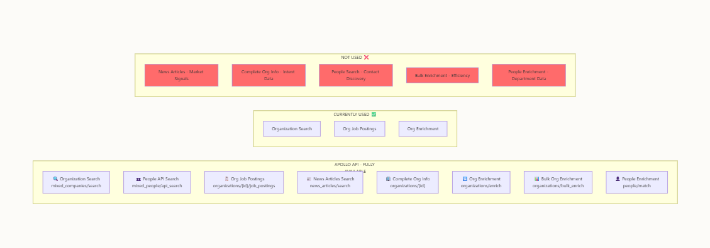

# Implementation Plan: Signal-Driven Company Discovery
**Date: 23rd December 2025**
**Status: Pre-Implementation - Awaiting Approval**
**Version: 2.0 (Comprehensive Rewrite)**

---

## Reference Diagrams

These diagrams define the architecture for the signal-driven discovery system:

### Apollo API Audit Diagram


Shows:
- **NOT USED (Red)**: News Articles, Complete Org Info, People Search (as signal), Bulk Enrichment, People Enrichment
- **CURRENTLY USED (Green)**: Organization Search, Org Job Postings, Org Enrichment
- **Full API Available**: All 8 Apollo endpoints

### Signal-Driven Discovery Flow


Shows:
- **Phase 1**: Intelligent Extraction (Skills, Technologies, Learning Outcomes)
- **Phase 2**: Multi-Signal Discovery (4 signals: Job Postings, Market Intelligence, Company Intelligence, People Intelligence)
- **Phase 3**: Multi-Scoring (Skill Match %, Market Signal Score, Department Fit Score, Contact Quality Score)
- **Phase 4**: Smart Generation (Rank → Generate → Graceful Fallback)

---

## Table of Contents

1. [Executive Summary](#executive-summary)
2. [Gap Analysis: Diagrams vs Current Implementation](#gap-analysis)
3. [Apollo API Reference](#apollo-api-reference)
4. [Database Schema Changes Required](#database-schema-changes)
5. [Implementation Phases](#implementation-phases)
   - [Phase 1: News Articles Integration (Signal 2)](#phase-1-news-articles-integration)
   - [Phase 2: Complete Org Info (Signal 3)](#phase-2-complete-org-info)
   - [Phase 3: Job-Skills Matching Engine (Signal 1)](#phase-3-job-skills-matching-engine)
   - [Phase 4: People Intelligence (Signal 4)](#phase-4-people-intelligence)
   - [Phase 5: Composite Signal Scoring](#phase-5-composite-signal-scoring)
   - [Phase 6: Graceful Fallback System](#phase-6-graceful-fallback)
   - [Phase 7: Bulk Enrichment Optimization](#phase-7-bulk-enrichment)
   - [Phase 8: Technology Filtering Re-enable](#phase-8-technology-filtering)
   - [Phase 9: Path Consistency](#phase-9-path-consistency)
6. [AI Pattern Reference](#ai-pattern-reference)
7. [Integration Architecture](#integration-architecture)
8. [Testing Plan](#testing-plan)
9. [Success Metrics](#success-metrics)
10. [Risks & Mitigations](#risks-and-mitigations)
11. [Approval Checklist](#approval-checklist)

---

## AI Pattern Reference

**DECISION: Standardize on Direct Google Gemini API (`GEMINI_API_KEY`) for ALL new code.**

### Why Direct Gemini API Only

1. **Coherence** - Codebase already uses direct Gemini for embeddings, alignment, web-grounded search
2. **No extra hop** - Direct API has lower latency than proxying through a gateway
3. **Full feature access** - Web grounding, structured outputs, all Gemini features available
4. **Single billing** - All AI usage goes through one Google Cloud account
5. **Already configured** - `GEMINI_API_KEY` is already in secrets and working

### Standard Pattern: Direct Google Gemini API (GEMINI_API_KEY)

**Use For:** ALL AI operations - embeddings, chat completions, structured extraction, tool calling

**Existing Implementations (reference these as patterns):**
- `supabase/functions/_shared/embedding-service.ts` - text-embedding-004 model
- `supabase/functions/_shared/alignment-service.ts` - gemini-2.0-flash-exp with structured output
- `supabase/functions/data-enrichment-pipeline/index.ts` - web-grounded search

**Pattern for Embeddings:**
```typescript
const GEMINI_API_KEY = Deno.env.get('GEMINI_API_KEY');
const response = await fetch(
  `https://generativelanguage.googleapis.com/v1beta/models/text-embedding-004:embedContent?key=${GEMINI_API_KEY}`,
  {
    method: 'POST',
    headers: { 'Content-Type': 'application/json' },
    body: JSON.stringify({
      model: 'models/text-embedding-004',
      content: { parts: [{ text: inputText }] }
    })
  }
);
const data = await response.json();
const embedding = data.embedding?.values || [];
```

**Pattern for Chat/Structured Output:**
```typescript
const GEMINI_API_KEY = Deno.env.get('GEMINI_API_KEY');
const response = await fetch(
  `https://generativelanguage.googleapis.com/v1beta/models/gemini-2.5-flash:generateContent?key=${GEMINI_API_KEY}`,
  {
    method: 'POST',
    headers: { 'Content-Type': 'application/json' },
    body: JSON.stringify({
      contents: [{ parts: [{ text: `${systemPrompt}\n\n${userPrompt}` }] }],
      generationConfig: { 
        temperature: 0.1,
        responseMimeType: 'application/json'  // For structured output
      }
    })
  }
);
```

**Pattern for Web-Grounded Search (unique to direct API):**
```typescript
const response = await fetch(
  `https://generativelanguage.googleapis.com/v1beta/models/gemini-2.0-flash-exp:generateContent?key=${GEMINI_API_KEY}`,
  {
    method: 'POST',
    headers: { 'Content-Type': 'application/json' },
    body: JSON.stringify({
      contents: [{ parts: [{ text: prompt }] }],
      tools: [{ google_search: {} }]  // Web grounding - NOT available via gateway
    })
  }
);
```

### Legacy Code (DO NOT USE for new code)

The following files currently use Lovable AI Gateway. They work but should NOT be copied for new implementations:
- `parse-syllabus/index.ts` - uses gateway (legacy)
- `generation-service.ts` - uses gateway (legacy)  
- `competency-extractor/index.ts` - uses gateway (legacy)
- `company-validation-service.ts` - uses gateway (legacy)

**Migration Note:** These can be migrated to direct Gemini in a future cleanup sprint, but it's not blocking.

### Signal Implementation Pattern Map

| Signal | AI Task Type | API to Use | Model |
|--------|--------------|------------|-------|
| Signal 1: Job-Skills Match | Semantic embeddings | Direct Gemini | text-embedding-004 |
| Signal 2: Market Intel | Text classification | Direct Gemini | gemini-2.5-flash |
| Signal 3: Dept Fit | Scoring logic | None (rule-based) | N/A |
| Signal 4: Contact Quality | Scoring logic | None (rule-based) | N/A |
| Composite Scoring | Weighted average | None (rule-based) | N/A |

---

## Executive Summary

Transform EduThree's company discovery system from **keyword-based guessing** to **signal-driven intelligence** that works for ANY syllabus (finance, engineering, arts, medicine) without hardcoded mappings.

### Current Problem
The discovery pipeline returns irrelevant companies (e.g., staffing firms for a Portfolio Management course) because:
1. Apollo API capabilities are severely underutilized (only 3 of 8 endpoints used)
2. Discovery uses keyword matching instead of market signals
3. Technology filtering is disabled ("crisis mode")
4. News/intent signals are NOT checked at all
5. Job postings are fetched but NOT matched to syllabus skills
6. People search is used for contacts AFTER discovery, not as a discovery signal

### Proposed Solution
Multi-layer intelligence discovery using **4 parallel signals** to find companies with **proven need**:

```
                              INPUT: ANY SYLLABUS
                                      │
                                      ▼
                    ┌─────────────────────────────────┐
                    │      PHASE 1: INTELLIGENT       │
                    │          EXTRACTION             │
                    │                                 │
                    │  • Extract Skills via AI        │
                    │  • Identify Technologies        │
                    │  • Map Learning Outcomes        │
                    │  • Map to SOC Codes             │
                    └─────────────────────────────────┘
                                      │
        ┌─────────────────────────────┼─────────────────────────────┐
        │                             │                             │
        ▼                             ▼                             ▼
┌───────────────┐           ┌───────────────┐           ┌───────────────┐
│   SIGNAL 1:   │           │   SIGNAL 2:   │           │   SIGNAL 3:   │
│ JOB POSTINGS  │           │    MARKET     │           │   COMPANY     │
│               │           │ INTELLIGENCE  │           │ INTELLIGENCE  │
│ • Search by   │           │               │           │               │
│   location    │           │ • News Search │           │ • Complete    │
│ • Fetch jobs  │           │ • Funding,    │           │   Org Info    │
│ • AI Match to │           │   hires,      │           │ • Intent      │
│   skills      │           │   contracts   │           │   signals     │
│               │           │ • Recency     │           │ • Dept growth │
└───────┬───────┘           └───────┬───────┘           └───────┬───────┘
        │                           │                           │
        │     ┌───────────────┐     │                           │
        │     │   SIGNAL 4:   │     │                           │
        │     │    PEOPLE     │     │                           │
        │     │ INTELLIGENCE  │     │                           │
        │     │               │     │                           │
        │     │ • People API  │     │                           │
        │     │ • Filter by   │     │                           │
        │     │   dept +      │     │                           │
        │     │   seniority   │     │                           │
        │     │ • Decision    │     │                           │
        │     │   makers      │     │                           │
        │     └───────┬───────┘     │                           │
        │             │             │                           │
        └─────────────┴─────────────┴───────────────────────────┘
                                      │
                                      ▼
                    ┌─────────────────────────────────┐
                    │     PHASE 3: MULTI-SCORING      │
                    │                                 │
                    │  Composite Suitability Score:   │
                    │  • Skill Match %      (0-25)    │
                    │  • Market Signal Score (0-25)   │
                    │  • Department Fit Score(0-25)   │
                    │  • Contact Quality Score(0-25)  │
                    │                                 │
                    │  Total: 0-100 points            │
                    └─────────────────────────────────┘
                                      │
                                      ▼
                    ┌─────────────────────────────────┐
                    │    PHASE 4: SMART GENERATION    │
                    │                                 │
                    │  • Rank by composite score      │
                    │  • Generate Projects            │
                    │  • Graceful Fallback if <       │
                    │    threshold                    │
                    └─────────────────────────────────┘
```

---

## Gap Analysis

### Current Implementation State vs Diagram Requirements

| Feature | Diagram Requirement | Current State | Gap | Priority |
|---------|---------------------|---------------|-----|----------|
| **Signal 1: Job Postings** | AI-powered skill matching | ⚠️ Fetches jobs but NO skill matching | Need Gemini embeddings integration | P0 |
| **Signal 2: News/Market Intelligence** | News API for hiring/funding signals | ❌ NOT IMPLEMENTED | Full implementation needed | P0 |
| **Signal 3: Company Intelligence** | Intent signals + dept growth | ❌ NOT IMPLEMENTED | Need Complete Org Info API | P0 |
| **Signal 4: People Intelligence** | People search as discovery signal | ⚠️ Used for contacts AFTER, not signal | Refactor as signal | P1 |
| **Composite Scoring** | 4-component 0-100 scoring | ❌ NOT IMPLEMENTED | Full scoring engine needed | P0 |
| **Graceful Fallback** | Adaptive thresholds | ⚠️ Basic exists | Needs enhancement | P1 |
| **Bulk Enrichment** | Batch 10 companies per call | ❌ Using individual calls | 50% API cost savings | P2 |
| **Technology Filtering** | Filter by tech stack | ❌ DISABLED (crisis mode) | Re-enable with fallback | P2 |
| **Database Storage** | Store signal scores | ❌ No columns exist | Schema migration needed | P0 |

### Current Code Files Analysis

| File | Current Purpose | Changes Needed |
|------|-----------------|----------------|
| `apollo-provider.ts` | Organization search + enrichment | Add 4 new signal methods |
| `discover-companies/index.ts` | Orchestrates discovery | Add composite scoring, fallback logic |
| `generate-projects/index.ts` | AI project generation | Consume signal scores for better prompts |
| `types.ts` | Provider interfaces | Add signal score types |
| `company_profiles` table | Stores companies | Add signal score columns |
| `generation_runs` table | Stores run metadata | Add signal aggregation columns |

---

## Apollo API Reference

### Currently Used Endpoints (3 of 8)

#### 1. Organization Search ✅ USED
**Endpoint:** `POST /api/v1/mixed_companies/search`
**Current Usage:** Primary company discovery

```typescript
// Current Implementation (apollo-provider.ts line ~1044)
const response = await fetch('https://api.apollo.io/v1/mixed_companies/search', {
  method: 'POST',
  headers: {
    'Content-Type': 'application/json',
    'X-Api-Key': this.apolloApiKey!
  },
  body: JSON.stringify({
    organization_locations: ["Kansas City, Missouri, United States"],
    q_organization_keyword_tags: ["financial services", "banking"],
    page: 1,
    per_page: 100
  })
});

// Response
{
  "organizations": [
    {
      "id": "5e66b6381e05b4008c8331b8",
      "name": "Acme Financial",
      "website_url": "https://acme.com",
      "estimated_num_employees": 150,
      "industry": "Financial Services",
      "city": "Kansas City",
      "state": "Missouri"
    }
  ],
  "pagination": { "page": 1, "total_entries": 1234 }
}
```

#### 2. Organization Enrichment ✅ USED
**Endpoint:** `POST /api/v1/organizations/enrich`
**Current Usage:** Get detailed company data

```typescript
// Current Implementation (apollo-provider.ts enrichSingleOrganization)
const response = await fetch('https://api.apollo.io/v1/organizations/enrich', {
  method: 'POST',
  headers: { 'X-Api-Key': this.apolloApiKey! },
  body: JSON.stringify({ domain: "acme.com" })
});

// Response - BASIC fields only (NOT using intent_signal_account or employee_metrics)
{
  "organization": {
    "id": "...",
    "name": "Acme Corp",
    "short_description": "Financial services company...",
    "departmental_head_count": { "engineering": 50, "finance": 20 },
    "funding_events": [...]
  }
}
```

#### 3. Job Postings ✅ USED (Partially)
**Endpoint:** `GET /api/v1/organizations/{id}/job_postings`
**Current Usage:** Fetches jobs but does NOT match to skills

```typescript
// Current Implementation (apollo-provider.ts line ~1350)
const response = await fetch(
  `https://api.apollo.io/v1/organizations/${apolloOrgId}/job_postings?per_page=10`,
  { headers: { 'X-Api-Key': this.apolloApiKey! } }
);

// Response
{
  "organization_job_postings": [
    {
      "id": "job_123",
      "title": "Senior Financial Analyst",  // NOT matched to syllabus skills!
      "url": "https://...",
      "posted_at": "2024-12-01"
    }
  ]
}
```

### NOT Used Endpoints (5 of 8) 🔴

#### 4. News Articles Search 🔴 NOT USED
**Endpoint:** `POST /api/v1/news_articles/search`
**Diagram Requirement:** Signal 2 - Market Intelligence

```typescript
// MISSING - Need to implement
const response = await fetch('https://api.apollo.io/v1/news_articles/search', {
  method: 'POST',
  headers: { 'X-Api-Key': APOLLO_API_KEY },
  body: JSON.stringify({
    organization_ids: ["5e66b6381e05b4008c8331b8"],
    categories: ["hires", "investment", "contract"],
    published_at: {
      min: "2024-09-23",  // 90 days ago
      max: "2024-12-23"   // today
    },
    per_page: 10
  })
});

// Expected Response
{
  "news_articles": [
    {
      "id": "article_123",
      "title": "Acme Corp Raises $50M Series B",
      "snippet": "The funding will expand engineering team...",
      "url": "https://techcrunch.com/...",
      "published_at": "2024-12-20T10:00:00Z",
      "event_categories": ["investment"],
      "organization_id": "5e66b6381e05b4008c8331b8"
    }
  ]
}
```

#### 5. Complete Organization Info 🔴 NOT USED
**Endpoint:** `GET /api/v1/organizations/{id}`
**Diagram Requirement:** Signal 3 - Intent Signals + Department Growth

```typescript
// MISSING - Need to implement
const response = await fetch(
  `https://api.apollo.io/v1/organizations/${orgId}`,
  { headers: { 'X-Api-Key': APOLLO_API_KEY } }
);

// Expected Response (includes intent_signal_account and employee_metrics)
{
  "organization": {
    "id": "5e66b6381e05b4008c8331b8",
    "name": "Acme Corp",
    
    // 🔥 INTENT SIGNALS - NOT BEING USED
    "intent_signal_account": {
      "overall_intent": "high",  // "high" | "medium" | "low"
      "total_visits": 150,
      "top_5_paths": ["/pricing", "/enterprise"]
    },
    
    // 🔥 EMPLOYEE METRICS - NOT BEING USED
    "employee_metrics": {
      "engineering": { "new": 15, "retained": 100, "churned": 3 },
      "finance": { "new": 5, "retained": 30, "churned": 1 },
      "sales": { "new": 10, "retained": 50, "churned": 5 }
    },
    
    // 🔥 TECHNOLOGY WITH UIDs - NOT BEING USED
    "current_technologies": [
      { "uid": "python", "name": "Python", "category": "Programming" },
      { "uid": "salesforce", "name": "Salesforce", "category": "CRM" }
    ]
  }
}
```

#### 6. Bulk Organization Enrichment 🔴 NOT USED
**Endpoint:** `POST /api/v1/organizations/bulk_enrich`
**Diagram Requirement:** API efficiency (50% rate limit savings)

```typescript
// MISSING - Currently doing individual enrichment calls
const response = await fetch('https://api.apollo.io/v1/organizations/bulk_enrich', {
  method: 'POST',
  headers: { 'X-Api-Key': APOLLO_API_KEY },
  body: JSON.stringify({
    domains: [
      "acme.com",
      "globex.com",
      "initech.com",
      "umbrella.com",
      "stark.com"
    ]  // Up to 10 at once
  })
});

// Response
{
  "organizations": [
    { /* full organization object */ },
    { /* full organization object */ },
    // ... up to 10
  ]
}
```

#### 7. People Search (as Signal) 🔴 NOT USED AS SIGNAL
**Endpoint:** `POST /api/v1/mixed_people/api_search`
**Current Usage:** Find contacts AFTER company selection
**Diagram Requirement:** Signal 4 - Use DURING discovery to rank companies

```typescript
// Current: Used to find contacts after company is selected
// Needed: Use to score companies by decision-maker availability

const response = await fetch('https://api.apollo.io/v1/mixed_people/api_search', {
  method: 'POST',
  headers: { 'X-Api-Key': APOLLO_API_KEY },
  body: JSON.stringify({
    organization_ids: ["5e66b6381e05b4008c8331b8"],
    person_titles: ["CFO", "Director of Finance", "VP Finance"],
    person_seniorities: ["director", "vp", "c_suite"],
    per_page: 10
  })
});

// Response
{
  "people": [
    {
      "id": "person_123",
      "first_name": "Jane",
      "last_name": "Doe",
      "title": "CFO",
      "email": "jane@acme.com",
      "email_status": "verified",
      "seniority": "c_suite"
    }
  ]
}
```

#### 8. People Enrichment 🔴 NOT USED
**Endpoint:** `POST /api/v1/people/enrich`
**Note:** Not required for signal-driven discovery but available for future contact quality enhancement.

---

## Database Schema Changes

### Required Migration

```sql
-- =====================================================
-- SIGNAL SCORES: Add to company_profiles table
-- =====================================================
ALTER TABLE public.company_profiles
ADD COLUMN IF NOT EXISTS skill_match_score NUMERIC DEFAULT NULL,
ADD COLUMN IF NOT EXISTS market_signal_score NUMERIC DEFAULT NULL,
ADD COLUMN IF NOT EXISTS department_fit_score NUMERIC DEFAULT NULL,
ADD COLUMN IF NOT EXISTS contact_quality_score NUMERIC DEFAULT NULL,
ADD COLUMN IF NOT EXISTS composite_signal_score NUMERIC DEFAULT NULL,
ADD COLUMN IF NOT EXISTS signal_confidence TEXT DEFAULT NULL,  -- 'high' | 'medium' | 'low'
ADD COLUMN IF NOT EXISTS signal_data JSONB DEFAULT NULL;       -- Raw signal details

COMMENT ON COLUMN company_profiles.skill_match_score IS 'Signal 1: 0-25 points based on job posting skill match';
COMMENT ON COLUMN company_profiles.market_signal_score IS 'Signal 2: 0-25 points based on news/funding activity';
COMMENT ON COLUMN company_profiles.department_fit_score IS 'Signal 3: 0-25 points based on intent + dept growth';
COMMENT ON COLUMN company_profiles.contact_quality_score IS 'Signal 4: 0-25 points based on decision-maker availability';
COMMENT ON COLUMN company_profiles.composite_signal_score IS 'Sum of all signals: 0-100 points';

-- =====================================================
-- GENERATION RUN SIGNAL AGGREGATES
-- =====================================================
ALTER TABLE public.generation_runs
ADD COLUMN IF NOT EXISTS signal_scores_summary JSONB DEFAULT NULL,
ADD COLUMN IF NOT EXISTS companies_above_threshold INTEGER DEFAULT NULL,
ADD COLUMN IF NOT EXISTS fallback_threshold_used INTEGER DEFAULT NULL,
ADD COLUMN IF NOT EXISTS news_api_calls INTEGER DEFAULT NULL,
ADD COLUMN IF NOT EXISTS people_api_calls INTEGER DEFAULT NULL;

-- =====================================================
-- INDEX for signal-based queries
-- =====================================================
CREATE INDEX IF NOT EXISTS idx_company_profiles_composite_score 
ON company_profiles(composite_signal_score DESC NULLS LAST);

CREATE INDEX IF NOT EXISTS idx_company_profiles_generation_run_score
ON company_profiles(generation_run_id, composite_signal_score DESC NULLS LAST);
```

---

## Implementation Phases

### Phase 1: News Articles Integration (Signal 2)
**Priority:** P0 - Critical
**Estimated Effort:** 4-6 hours
**Files to Modify:**
- `supabase/functions/discover-companies/providers/apollo-provider.ts`

#### Implementation

```typescript
// Add to apollo-provider.ts

interface NewsArticle {
  id: string;
  title: string;
  snippet: string;
  url: string;
  published_at: string;
  event_categories: string[];
  organization_id: string;
}

interface MarketSignalResult {
  score: number;           // 0-1 normalized
  articles: NewsArticle[];
  hasFundingNews: boolean;
  hasHiringNews: boolean;
  hasContractNews: boolean;
  mostRecentDate: string | null;
}

/**
 * SIGNAL 2: Market Intelligence via News Articles
 * Fetches recent news about companies to identify active/growing businesses
 */
async function fetchMarketSignals(
  organizationIds: string[]
): Promise<Map<string, MarketSignalResult>> {
  const results = new Map<string, MarketSignalResult>();
  
  // Initialize empty results for all orgs
  for (const orgId of organizationIds) {
    results.set(orgId, {
      score: 0,
      articles: [],
      hasFundingNews: false,
      hasHiringNews: false,
      hasContractNews: false,
      mostRecentDate: null
    });
  }
  
  if (organizationIds.length === 0) return results;
  
  // Calculate date range (last 90 days)
  const today = new Date();
  const ninetyDaysAgo = new Date(today.getTime() - (90 * 24 * 60 * 60 * 1000));
  
  try {
    // Batch request (Apollo allows multiple org IDs)
    const response = await fetch('https://api.apollo.io/v1/news_articles/search', {
      method: 'POST',
      headers: {
        'Content-Type': 'application/json',
        'X-Api-Key': this.apolloApiKey!
      },
      body: JSON.stringify({
        organization_ids: organizationIds.slice(0, 25), // API limit
        categories: ['hires', 'investment', 'contract'],
        published_at: {
          min: ninetyDaysAgo.toISOString().split('T')[0],
          max: today.toISOString().split('T')[0]
        },
        per_page: 50
      })
    });
    
    if (!response.ok) {
      console.warn(`News API returned ${response.status}, using empty results`);
      return results;
    }
    
    const data = await response.json();
    const articles = (data.news_articles || []) as NewsArticle[];
    
    console.log(`📰 News API: Found ${articles.length} articles for ${organizationIds.length} companies`);
    
    // Group articles by organization
    for (const article of articles) {
      const orgResult = results.get(article.organization_id);
      if (!orgResult) continue;
      
      orgResult.articles.push(article);
      
      // Track categories
      if (article.event_categories.includes('investment')) {
        orgResult.hasFundingNews = true;
      }
      if (article.event_categories.includes('hires')) {
        orgResult.hasHiringNews = true;
      }
      if (article.event_categories.includes('contract')) {
        orgResult.hasContractNews = true;
      }
      
      // Track recency
      if (!orgResult.mostRecentDate || article.published_at > orgResult.mostRecentDate) {
        orgResult.mostRecentDate = article.published_at;
      }
    }
    
    // Calculate scores
    for (const [orgId, result] of results) {
      result.score = calculateMarketSignalScore(result);
    }
    
    return results;
    
  } catch (error) {
    console.error('News API error:', error);
    return results; // Return empty results on error
  }
}

/**
 * Calculate market signal score (0-1)
 * Weights: Funding > Hiring > Contract > Recency
 */
function calculateMarketSignalScore(result: MarketSignalResult): number {
  if (result.articles.length === 0) return 0.1; // Baseline for no news
  
  let score = 0;
  
  // Category scores (max 0.6)
  if (result.hasFundingNews) score += 0.25;  // Funding = highest signal
  if (result.hasHiringNews) score += 0.20;   // Hiring = growing
  if (result.hasContractNews) score += 0.15; // Contracts = revenue
  
  // Volume score (max 0.2)
  const volumeScore = Math.min(0.2, result.articles.length * 0.04);
  score += volumeScore;
  
  // Recency score (max 0.2)
  if (result.mostRecentDate) {
    const daysSinceNews = Math.floor(
      (Date.now() - new Date(result.mostRecentDate).getTime()) / (1000 * 60 * 60 * 24)
    );
    const recencyScore = Math.max(0, 0.2 - (daysSinceNews / 90) * 0.2);
    score += recencyScore;
  }
  
  return Math.min(1, score);
}
```

#### Integration Point

```typescript
// In enrichOrganizations() method, after initial org list:

// Batch fetch market signals for all organizations
const orgIds = organizations.map(o => o.id).filter(Boolean);
const marketSignals = await this.fetchMarketSignals(orgIds);

// Apply to each company during enrichment
for (const org of organizations) {
  const signals = marketSignals.get(org.id);
  company.marketSignalScore = signals ? signals.score * 25 : 0; // 0-25 points
  company.signalData = company.signalData || {};
  company.signalData.marketSignals = signals;
}
```

---

### Phase 2: Complete Org Info (Signal 3)
**Priority:** P0 - Critical
**Estimated Effort:** 4-6 hours
**Files to Modify:**
- `supabase/functions/discover-companies/providers/apollo-provider.ts`

#### Implementation

```typescript
interface IntentSignalAccount {
  overall_intent: 'high' | 'medium' | 'low';
  total_visits: number;
  top_5_paths: string[];
}

interface EmployeeMetrics {
  [department: string]: {
    new: number;
    retained: number;
    churned: number;
  };
}

interface OrganizationIntelligence {
  intentSignals: IntentSignalAccount | null;
  employeeMetrics: EmployeeMetrics | null;
  technologies: Array<{ uid: string; name: string; category: string }>;
  buyingIntentScore: number;        // 0-1
  departmentGrowthScore: number;    // 0-1
  technologyMatchScore: number;     // 0-1
  combinedFitScore: number;         // 0-1
}

/**
 * SIGNAL 3: Company Intelligence via Complete Org Info
 * Gets intent signals and department growth metrics
 */
async function fetchOrganizationIntelligence(
  orgId: string,
  syllabusDomain: 'finance' | 'engineering' | 'marketing' | 'operations' | 'unknown',
  syllabusSkills: string[] = []
): Promise<OrganizationIntelligence> {
  const defaultResult: OrganizationIntelligence = {
    intentSignals: null,
    employeeMetrics: null,
    technologies: [],
    buyingIntentScore: 0.3,      // Neutral default
    departmentGrowthScore: 0.3,
    technologyMatchScore: 0.3,
    combinedFitScore: 0.3
  };
  
  try {
    const response = await fetch(
      `https://api.apollo.io/v1/organizations/${orgId}`,
      {
        headers: {
          'Content-Type': 'application/json',
          'X-Api-Key': this.apolloApiKey!
        }
      }
    );
    
    if (!response.ok) {
      console.warn(`Complete Org API returned ${response.status} for ${orgId}`);
      return defaultResult;
    }
    
    const data = await response.json();
    const org = data.organization;
    
    if (!org) return defaultResult;
    
    // Extract signals
    const intentSignals = org.intent_signal_account || null;
    const employeeMetrics = org.employee_metrics || null;
    const technologies = org.current_technologies || [];
    
    // Calculate buying intent score
    let buyingIntentScore = 0.3;
    if (intentSignals) {
      buyingIntentScore = 
        intentSignals.overall_intent === 'high' ? 1.0 :
        intentSignals.overall_intent === 'medium' ? 0.6 : 0.3;
    }
    
    // Calculate department growth score
    let departmentGrowthScore = 0.3;
    if (employeeMetrics) {
      // Map syllabus domain to department
      const deptMap: Record<string, string> = {
        finance: 'finance',
        engineering: 'engineering',
        marketing: 'marketing',
        operations: 'operations',
        unknown: 'engineering' // default
      };
      
      const relevantDept = deptMap[syllabusDomain] || 'engineering';
      const deptMetrics = employeeMetrics[relevantDept];
      
      if (deptMetrics) {
        const growthRate = deptMetrics.new / Math.max(1, deptMetrics.retained);
        const churnRate = deptMetrics.churned / Math.max(1, deptMetrics.retained);
        
        // Growing department with low churn = best
        departmentGrowthScore = Math.min(1, 
          (growthRate * 0.7) + ((1 - churnRate) * 0.3)
        );
      }
    }
    
    // Calculate technology match score
    let technologyMatchScore = 0.3;
    if (technologies.length > 0 && syllabusSkills.length > 0) {
      const techNames = technologies.map(t => t.name.toLowerCase());
      const matchCount = syllabusSkills.filter(skill => 
        techNames.some(tech => 
          tech.includes(skill.toLowerCase()) || 
          skill.toLowerCase().includes(tech)
        )
      ).length;
      
      technologyMatchScore = Math.min(1, matchCount / Math.min(5, syllabusSkills.length));
    }
    
    // Combined fit score (weighted average)
    const combinedFitScore = 
      (buyingIntentScore * 0.4) + 
      (departmentGrowthScore * 0.4) + 
      (technologyMatchScore * 0.2);
    
    return {
      intentSignals,
      employeeMetrics,
      technologies,
      buyingIntentScore,
      departmentGrowthScore,
      technologyMatchScore,
      combinedFitScore
    };
    
  } catch (error) {
    console.error(`Failed to fetch org intelligence for ${orgId}:`, error);
    return defaultResult;
  }
}
```

---

### Phase 3: Job-Skills Matching Engine (Signal 1)
**Priority:** P1 - High
**Estimated Effort:** 6-8 hours
**Files to Create:**
- `supabase/functions/_shared/job-skills-matcher.ts`

#### Implementation

```typescript
// supabase/functions/_shared/job-skills-matcher.ts

interface JobPosting {
  id: string;
  title: string;
  url?: string;
  posted_at?: string;
}

interface ExtractedSkill {
  skill: string;
  category: string;
  confidence: number;
}

interface JobSkillMatch {
  jobTitle: string;
  matchedSkill: string;
  confidence: number;
}

interface JobSkillsMatchResult {
  matchScore: number;         // 0-1 overall match
  matchedPairs: JobSkillMatch[];
  unmatchedJobs: string[];
  unmatchedSkills: string[];
  hasRelevantJobs: boolean;
}

/**
/**
 * SIGNAL 1: Semantic Job-Skills Matching using Gemini Embeddings
 * 
 * IMPORTANT: This uses the DIRECT Google Gemini API (GEMINI_API_KEY) 
 * NOT the Lovable AI Gateway, to maintain consistency with:
 *   - supabase/functions/_shared/embedding-service.ts
 *   - supabase/functions/_shared/alignment-service.ts
 *   - supabase/functions/data-enrichment-pipeline/index.ts
 * 
 * The codebase uses two AI patterns:
 *   1. Direct Gemini API (GEMINI_API_KEY) - for embeddings, alignment, web-grounded search
 *   2. Lovable Gateway (LOVABLE_API_KEY) - for chat completions (parse-syllabus, generation, competency-extraction)
 * 
 * Signal 1 is embedding-based semantic matching, so it uses pattern #1.
 */

// Reuse existing embedding service
import { computeCosineSimilarity } from './embedding-service.ts';

const GEMINI_API_URL = 'https://generativelanguage.googleapis.com/v1beta';
const GEMINI_EMBEDDING_MODEL = 'text-embedding-004';

export async function matchJobsToSkills(
  jobPostings: JobPosting[],
  syllabusSkills: ExtractedSkill[]
): Promise<JobSkillsMatchResult> {
  const GEMINI_API_KEY = Deno.env.get('GEMINI_API_KEY');
  if (!GEMINI_API_KEY) {
    throw new Error('GEMINI_API_KEY not configured');
  }

  const defaultResult: JobSkillsMatchResult = {
    matchScore: 0,
    matchedPairs: [],
    unmatchedJobs: jobPostings.map(j => j.title),
    unmatchedSkills: syllabusSkills.map(s => s.skill),
    hasRelevantJobs: false
  };
  
  if (jobPostings.length === 0 || syllabusSkills.length === 0) {
    return defaultResult;
  }
  
  const jobTitles = jobPostings.map(j => j.title).slice(0, 20);
  const skills = syllabusSkills.map(s => s.skill).slice(0, 20);
  
  try {
    // Get embeddings for jobs and skills using direct Gemini API
    const [jobEmbeddings, skillEmbeddings] = await Promise.all([
      batchGetEmbeddings(jobTitles, GEMINI_API_KEY),
      batchGetEmbeddings(skills, GEMINI_API_KEY)
    ]);
    
    // Calculate semantic similarity matrix
    const matchedPairs: Array<{ job: string; skill: string; confidence: number }> = [];
    const matchedJobs = new Set<string>();
    const matchedSkills = new Set<string>();
    
    for (let i = 0; i < jobTitles.length; i++) {
      for (let j = 0; j < skills.length; j++) {
        const similarity = computeCosineSimilarity(jobEmbeddings[i], skillEmbeddings[j]);
        
        // Threshold: 0.7 for semantic relevance
        if (similarity >= 0.7) {
          matchedPairs.push({
            job: jobTitles[i],
            skill: skills[j],
            confidence: similarity
          });
          matchedJobs.add(jobTitles[i]);
          matchedSkills.add(skills[j]);
        }
      }
    }
    
    // Sort by confidence descending
    matchedPairs.sort((a, b) => b.confidence - a.confidence);
    
    // Calculate overall match score
    const avgConfidence = matchedPairs.length > 0
      ? matchedPairs.reduce((sum, p) => sum + p.confidence, 0) / matchedPairs.length
      : 0;
    const coverageScore = matchedSkills.size / skills.length;
    const matchScore = Math.round((avgConfidence * 0.6 + coverageScore * 0.4) * 100);
    
    return {
      matchScore,
      matchedPairs: matchedPairs.slice(0, 15), // Top 15 matches
      unmatchedJobs: jobTitles.filter(j => !matchedJobs.has(j)),
      unmatchedSkills: skills.filter(s => !matchedSkills.has(s)),
      hasRelevantJobs: matchedPairs.length >= 2
    };
    
  } catch (error) {
    console.error('Signal 1 matching error:', error);
    return defaultResult;
  }
}

/**
 * Batch get embeddings using direct Gemini API
 * Matches pattern in embedding-service.ts
 */
async function batchGetEmbeddings(texts: string[], apiKey: string): Promise<number[][]> {
  const embeddings: number[][] = [];
  
  for (const text of texts) {
    const response = await fetch(
      `${GEMINI_API_URL}/models/${GEMINI_EMBEDDING_MODEL}:embedContent?key=${apiKey}`,
      {
        method: 'POST',
        headers: { 'Content-Type': 'application/json' },
        body: JSON.stringify({
          model: `models/${GEMINI_EMBEDDING_MODEL}`,
          content: { parts: [{ text: text.substring(0, 1000) }] }
        })
      }
    );
    
    if (!response.ok) {
      console.error(`Embedding failed for: ${text.substring(0, 50)}...`);
      embeddings.push([]); // Empty embedding for failed items
      continue;
    }
    
    const data = await response.json();
    embeddings.push(data.embedding?.values || []);
  }
  
  return embeddings;
        ],
        tool_choice: { type: "function", function: { name: "report_matches" } }
      })
    });
    
    if (!response.ok) {
      console.error('Job-skills AI matching failed:', response.status);
      return defaultResult;
    }
    
    const data = await response.json();
    const toolCall = data.choices?.[0]?.message?.tool_calls?.[0];
    
    if (!toolCall) {
      // Try parsing from content
      const content = data.choices?.[0]?.message?.content;
      const jsonMatch = content?.match(/\{[\s\S]*\}/);
      if (jsonMatch) {
        const parsed = JSON.parse(jsonMatch[0]);
        return processMatches(parsed.matches || [], jobTitles, skills);
      }
      return defaultResult;
    }
    
    const args = JSON.parse(toolCall.function.arguments);
    return processMatches(args.matches || [], jobTitles, skills);
    
  } catch (error) {
    console.error('Job-skills matching error:', error);
    return defaultResult;
  }
}

function processMatches(
  matches: Array<{ job: string; skill: string; confidence: number }>,
  allJobs: string[],
  allSkills: string[]
): JobSkillsMatchResult {
  const validMatches = matches.filter(m => 
    m.confidence >= 0.5 && 
    allJobs.some(j => j.toLowerCase() === m.job.toLowerCase()) &&
    allSkills.some(s => s.toLowerCase() === m.skill.toLowerCase())
  );
  
  const matchedJobSet = new Set(validMatches.map(m => m.job.toLowerCase()));
  const matchedSkillSet = new Set(validMatches.map(m => m.skill.toLowerCase()));
  
  const unmatchedJobs = allJobs.filter(j => !matchedJobSet.has(j.toLowerCase()));
  const unmatchedSkills = allSkills.filter(s => !matchedSkillSet.has(s.toLowerCase()));
  
  // Calculate overall score
  const matchScore = validMatches.length > 0
    ? validMatches.reduce((sum, m) => sum + m.confidence, 0) / Math.max(allJobs.length, allSkills.length)
    : 0;
  
  return {
    matchScore: Math.min(1, matchScore),
    matchedPairs: validMatches.map(m => ({
      jobTitle: m.job,
      matchedSkill: m.skill,
      confidence: m.confidence
    })),
    unmatchedJobs,
    unmatchedSkills,
    hasRelevantJobs: validMatches.length > 0
  };
}
```

---

### Phase 4: People Intelligence (Signal 4)
**Priority:** P1 - High
**Estimated Effort:** 4-6 hours
**Files to Modify:**
- `supabase/functions/discover-companies/providers/apollo-provider.ts`

#### Implementation

```typescript
interface PeopleIntelligenceResult {
  hasDecisionMakers: boolean;
  relevantContactCount: number;
  seniorityDistribution: {
    c_suite: number;
    vp: number;
    director: number;
    manager: number;
  };
  contactQualityScore: number;  // 0-1
  topContacts: Array<{
    name: string;
    title: string;
    seniority: string;
    emailVerified: boolean;
  }>;
}

/**
 * SIGNAL 4: People Intelligence
 * Find decision-makers in relevant departments to score partnership potential
 */
async function fetchPeopleIntelligence(
  organizationId: string,
  syllabusDomain: 'finance' | 'engineering' | 'marketing' | 'operations' | 'unknown'
): Promise<PeopleIntelligenceResult> {
  const defaultResult: PeopleIntelligenceResult = {
    hasDecisionMakers: false,
    relevantContactCount: 0,
    seniorityDistribution: { c_suite: 0, vp: 0, director: 0, manager: 0 },
    contactQualityScore: 0.2,
    topContacts: []
  };
  
  // Map syllabus domain to relevant person titles
  const departmentTitles: Record<string, string[]> = {
    finance: ['CFO', 'Controller', 'Director of Finance', 'VP Finance', 'Finance Manager'],
    engineering: ['CTO', 'VP Engineering', 'Director of Engineering', 'Engineering Manager', 'Head of Engineering'],
    marketing: ['CMO', 'VP Marketing', 'Director of Marketing', 'Marketing Manager', 'Head of Marketing'],
    operations: ['COO', 'VP Operations', 'Director of Operations', 'Operations Manager'],
    unknown: ['CEO', 'COO', 'Director', 'VP']  // Generic fallback
  };
  
  const titles = departmentTitles[syllabusDomain] || departmentTitles.unknown;
  
  try {
    const response = await fetch('https://api.apollo.io/v1/mixed_people/api_search', {
      method: 'POST',
      headers: {
        'Content-Type': 'application/json',
        'X-Api-Key': this.apolloApiKey!
      },
      body: JSON.stringify({
        organization_ids: [organizationId],
        person_titles: titles,
        person_seniorities: ['director', 'vp', 'c_suite', 'owner'],
        per_page: 10
      })
    });
    
    if (!response.ok) {
      console.warn(`People API returned ${response.status} for org ${organizationId}`);
      return defaultResult;
    }
    
    const data = await response.json();
    const people = data.people || [];
    
    if (people.length === 0) {
      return defaultResult;
    }
    
    // Calculate seniority distribution
    const seniorityDistribution = { c_suite: 0, vp: 0, director: 0, manager: 0 };
    const topContacts: PeopleIntelligenceResult['topContacts'] = [];
    
    for (const person of people) {
      const seniority = person.seniority || 'unknown';
      
      if (seniority === 'c_suite') seniorityDistribution.c_suite++;
      else if (seniority === 'vp') seniorityDistribution.vp++;
      else if (seniority === 'director') seniorityDistribution.director++;
      else if (seniority === 'manager') seniorityDistribution.manager++;
      
      if (topContacts.length < 3) {
        topContacts.push({
          name: `${person.first_name} ${person.last_name}`,
          title: person.title || 'Unknown',
          seniority: seniority,
          emailVerified: person.email_status === 'verified'
        });
      }
    }
    
    // Calculate contact quality score
    let score = 0;
    score += seniorityDistribution.c_suite * 0.25;
    score += seniorityDistribution.vp * 0.20;
    score += seniorityDistribution.director * 0.15;
    score += seniorityDistribution.manager * 0.10;
    
    // Bonus for verified emails
    const verifiedCount = people.filter(p => p.email_status === 'verified').length;
    score += (verifiedCount / people.length) * 0.2;
    
    return {
      hasDecisionMakers: seniorityDistribution.c_suite > 0 || seniorityDistribution.vp > 0 || seniorityDistribution.director > 0,
      relevantContactCount: people.length,
      seniorityDistribution,
      contactQualityScore: Math.min(1, score),
      topContacts
    };
    
  } catch (error) {
    console.error(`People intelligence error for org ${organizationId}:`, error);
    return defaultResult;
  }
}
```

---

### Phase 5: Composite Signal Scoring
**Priority:** P0 - Critical
**Estimated Effort:** 4-6 hours
**Files to Create:**
- `supabase/functions/_shared/signal-scoring-service.ts`

#### Implementation

```typescript
// supabase/functions/_shared/signal-scoring-service.ts

export interface SignalScores {
  skillMatch: number;        // 0-25 points (Signal 1)
  marketSignal: number;      // 0-25 points (Signal 2)
  departmentFit: number;     // 0-25 points (Signal 3)
  contactQuality: number;    // 0-25 points (Signal 4)
}

export interface CompositeSignalScore {
  overall: number;           // 0-100 total
  confidence: 'high' | 'medium' | 'low';
  components: SignalScores;
  signals: {
    hasActiveJobPostings: boolean;
    hasFundingNews: boolean;
    hasHiringNews: boolean;
    hasDepartmentGrowth: boolean;
    hasTechnologyMatch: boolean;
    hasDecisionMakers: boolean;
  };
  breakdown: string;  // Human-readable explanation
}

/**
 * Calculate composite signal score for a company
 * Each signal contributes 0-25 points for a total of 0-100
 */
export function calculateCompositeScore(
  jobSkillsMatch: { matchScore: number; hasRelevantJobs: boolean },
  marketSignals: { score: number; hasFundingNews: boolean; hasHiringNews: boolean },
  orgIntelligence: { combinedFitScore: number; departmentGrowthScore: number; technologyMatchScore: number },
  peopleIntelligence: { contactQualityScore: number; hasDecisionMakers: boolean }
): CompositeSignalScore {
  // Convert 0-1 scores to 0-25 point scale
  const components: SignalScores = {
    skillMatch: jobSkillsMatch.matchScore * 25,
    marketSignal: marketSignals.score * 25,
    departmentFit: orgIntelligence.combinedFitScore * 25,
    contactQuality: peopleIntelligence.contactQualityScore * 25
  };
  
  // Calculate total
  const overall = 
    components.skillMatch + 
    components.marketSignal + 
    components.departmentFit + 
    components.contactQuality;
  
  // Determine confidence level
  const signalCount = [
    jobSkillsMatch.hasRelevantJobs,
    marketSignals.hasFundingNews || marketSignals.hasHiringNews,
    orgIntelligence.departmentGrowthScore > 0.5,
    peopleIntelligence.hasDecisionMakers
  ].filter(Boolean).length;
  
  const confidence: 'high' | 'medium' | 'low' = 
    signalCount >= 3 ? 'high' :
    signalCount >= 2 ? 'medium' : 'low';
  
  // Build signals summary
  const signals = {
    hasActiveJobPostings: jobSkillsMatch.hasRelevantJobs,
    hasFundingNews: marketSignals.hasFundingNews,
    hasHiringNews: marketSignals.hasHiringNews,
    hasDepartmentGrowth: orgIntelligence.departmentGrowthScore > 0.5,
    hasTechnologyMatch: orgIntelligence.technologyMatchScore > 0.5,
    hasDecisionMakers: peopleIntelligence.hasDecisionMakers
  };
  
  // Build breakdown explanation
  const breakdownParts: string[] = [];
  if (components.skillMatch >= 15) breakdownParts.push('Strong job-skill match');
  if (components.marketSignal >= 15) breakdownParts.push('Active market signals');
  if (components.departmentFit >= 15) breakdownParts.push('Good department fit');
  if (components.contactQuality >= 15) breakdownParts.push('Quality decision-makers');
  
  const breakdown = breakdownParts.length > 0 
    ? breakdownParts.join(', ')
    : 'Limited signals available';
  
  return {
    overall: Math.round(overall * 10) / 10,  // Round to 1 decimal
    confidence,
    components,
    signals,
    breakdown
  };
}

/**
 * Batch calculate composite scores for multiple companies
 */
export async function calculateBatchCompositeScores(
  companies: Array<{
    id: string;
    jobSkillsMatch: any;
    marketSignals: any;
    orgIntelligence: any;
    peopleIntelligence: any;
  }>
): Promise<Map<string, CompositeSignalScore>> {
  const results = new Map<string, CompositeSignalScore>();
  
  for (const company of companies) {
    const score = calculateCompositeScore(
      company.jobSkillsMatch,
      company.marketSignals,
      company.orgIntelligence,
      company.peopleIntelligence
    );
    results.set(company.id, score);
  }
  
  return results;
}
```

---

### Phase 6: Graceful Fallback System
**Priority:** P1 - High
**Estimated Effort:** 3-4 hours
**Files to Modify:**
- `supabase/functions/discover-companies/index.ts`

#### Implementation

```typescript
interface FallbackResult {
  companies: DiscoveredCompany[];
  confidence: 'high' | 'medium' | 'low';
  thresholdUsed: number;
  fallbackReason: string | null;
  warning: string | null;
}

/**
 * Discover companies with adaptive threshold fallback
 * Ensures we always return usable results while being transparent about quality
 */
async function discoverWithFallback(
  provider: DiscoveryProvider,
  context: CourseContext,
  targetCount: number
): Promise<FallbackResult> {
  const INITIAL_THRESHOLD = 70;   // High bar
  const MIN_THRESHOLD = 25;       // Absolute minimum
  const THRESHOLD_STEP = 15;      // Reduction per iteration
  const MIN_COMPANIES = 3;        // Minimum viable for project generation
  
  // Run discovery
  const result = await provider.discover(context);
  const companies = result.companies;
  
  console.log(`\n📊 FALLBACK EVALUATION`);
  console.log(`   Total discovered: ${companies.length}`);
  console.log(`   Target count: ${targetCount}`);
  
  if (companies.length === 0) {
    return {
      companies: [],
      confidence: 'low',
      thresholdUsed: 0,
      fallbackReason: 'No companies found in Apollo search',
      warning: 'Discovery returned zero results. Check location/industry filters.'
    };
  }
  
  // Sort by composite score (descending)
  companies.sort((a, b) => 
    (b.compositeSignalScore || 0) - (a.compositeSignalScore || 0)
  );
  
  // Try to find enough companies above threshold
  let threshold = INITIAL_THRESHOLD;
  let aboveThreshold: DiscoveredCompany[] = [];
  
  while (threshold >= MIN_THRESHOLD) {
    aboveThreshold = companies.filter(c => 
      (c.compositeSignalScore || 0) >= threshold
    );
    
    console.log(`   Threshold ${threshold}: ${aboveThreshold.length} companies`);
    
    if (aboveThreshold.length >= MIN_COMPANIES) {
      break;
    }
    
    threshold -= THRESHOLD_STEP;
  }
  
  // Determine final result
  if (aboveThreshold.length >= MIN_COMPANIES) {
    const finalCompanies = aboveThreshold.slice(0, targetCount);
    return {
      companies: finalCompanies,
      confidence: threshold >= 55 ? 'high' : threshold >= 40 ? 'medium' : 'low',
      thresholdUsed: threshold,
      fallbackReason: threshold < INITIAL_THRESHOLD 
        ? `Lowered threshold from ${INITIAL_THRESHOLD} to ${threshold} to find ${MIN_COMPANIES}+ companies`
        : null,
      warning: threshold < 40 
        ? 'Lower confidence matches - faculty review recommended'
        : null
    };
  }
  
  // Ultimate fallback: return best available
  const bestAvailable = companies.slice(0, Math.min(targetCount, MIN_COMPANIES));
  
  console.log(`   ⚠️  FALLBACK: Returning best ${bestAvailable.length} companies (below all thresholds)`);
  
  return {
    companies: bestAvailable,
    confidence: 'low',
    thresholdUsed: 0,
    fallbackReason: `Only ${companies.length} companies found. Returning best ${bestAvailable.length} matches below threshold.`,
    warning: 'Limited matches available - faculty review strongly recommended'
  };
}
```

---

### Phase 7: Bulk Enrichment Optimization
**Priority:** P2 - Medium
**Estimated Effort:** 2-3 hours
**Files to Modify:**
- `supabase/functions/discover-companies/providers/apollo-provider.ts`

#### Implementation

```typescript
/**
 * Bulk enrich organizations (up to 10 at a time)
 * Saves ~50% on API rate limits compared to individual calls
 */
async function bulkEnrichOrganizations(
  domains: string[]
): Promise<Map<string, ApolloOrganization>> {
  const results = new Map<string, ApolloOrganization>();
  const BATCH_SIZE = 10;
  
  console.log(`\n📦 BULK ENRICHMENT: ${domains.length} domains`);
  
  for (let i = 0; i < domains.length; i += BATCH_SIZE) {
    const batch = domains.slice(i, i + BATCH_SIZE);
    
    try {
      const response = await fetch('https://api.apollo.io/v1/organizations/bulk_enrich', {
        method: 'POST',
        headers: {
          'Content-Type': 'application/json',
          'X-Api-Key': this.apolloApiKey!
        },
        body: JSON.stringify({ domains: batch })
      });
      
      if (!response.ok) {
        console.warn(`Bulk enrichment batch ${i/BATCH_SIZE + 1} failed: ${response.status}`);
        // Fall back to individual enrichment for this batch
        for (const domain of batch) {
          const org = await this.individualEnrich(domain);
          if (org) results.set(domain, org);
        }
        continue;
      }
      
      const data = await response.json();
      const orgs = data.organizations || [];
      
      for (const org of orgs) {
        if (org.primary_domain) {
          results.set(org.primary_domain, org);
        }
      }
      
      console.log(`   Batch ${i/BATCH_SIZE + 1}: ${orgs.length} enriched`);
      
      // Rate limiting between batches
      await new Promise(resolve => setTimeout(resolve, 500));
      
    } catch (error) {
      console.error(`Bulk enrichment batch error:`, error);
    }
  }
  
  console.log(`   ✅ Total enriched: ${results.size}/${domains.length}`);
  
  return results;
}
```

---

### Phase 8: Technology Filtering Re-enable
**Priority:** P2 - Medium
**Estimated Effort:** 2-3 hours
**Files to Modify:**
- `supabase/functions/discover-companies/providers/apollo-provider.ts`

#### Implementation

```typescript
/**
 * Re-enable technology filtering with fallback
 * Currently DISABLED in crisis mode - needs careful re-enablement
 */
function generateTechnologyFilter(
  syllabusSkills: ExtractedSkill[],
  onetTechnologies: string[]
): string[] | undefined {
  // Combine skill-based and O*NET-based technologies
  const techKeywords = new Set<string>();
  
  // Add O*NET technologies
  for (const tech of onetTechnologies.slice(0, 5)) {
    const uid = mapTechnologyToApolloUID(tech);
    if (uid) techKeywords.add(uid);
  }
  
  // Add skill-derived technologies
  for (const skill of syllabusSkills) {
    if (skill.category === 'tool' || skill.category === 'framework') {
      const uid = mapTechnologyToApolloUID(skill.skill);
      if (uid) techKeywords.add(uid);
    }
  }
  
  const techArray = Array.from(techKeywords);
  
  // Only apply filter if we have reasonable tech matches
  if (techArray.length >= 2 && techArray.length <= 10) {
    console.log(`   🔧 Technology filter enabled: ${techArray.join(', ')}`);
    return techArray;
  }
  
  console.log(`   ⚠️  Technology filter skipped (${techArray.length} techs - too few/many)`);
  return undefined;
}

// Apollo technology UID mapping (subset)
function mapTechnologyToApolloUID(tech: string): string | null {
  const mapping: Record<string, string> = {
    'python': 'python',
    'javascript': 'javascript',
    'typescript': 'typescript',
    'react': 'react',
    'node.js': 'nodejs',
    'sql': 'sql',
    'aws': 'aws',
    'azure': 'azure',
    'salesforce': 'salesforce',
    'excel': 'excel',
    'tableau': 'tableau',
    'power bi': 'powerbi',
    'sap': 'sap',
    'oracle': 'oracle',
    'java': 'java',
    'c++': 'cpp',
    'kubernetes': 'kubernetes',
    'docker': 'docker',
    'tensorflow': 'tensorflow',
    'pytorch': 'pytorch'
  };
  
  const normalized = tech.toLowerCase().trim();
  return mapping[normalized] || null;
}
```

---

### Phase 9: Path Consistency
**Priority:** P2 - Medium
**Estimated Effort:** 3-4 hours
**Files to Modify:**
- `src/pages/Configure.tsx`
- `src/pages/ReviewSyllabus.tsx`
- `supabase/functions/generate-projects/index.ts`

#### Goal
Ensure both discovery paths (Configure page and ReviewSyllabus page) use identical:
1. Discovery pipeline with all 4 signals
2. Composite scoring system
3. Fallback logic
4. UI warnings/feedback

---

## Integration Architecture

### How All Phases Work Together

```
┌──────────────────────────────────────────────────────────────────────┐
│                        discover-companies/index.ts                    │
│                                                                       │
│  1. Get course context (SOC mapping, skills, location)               │
│  2. Initialize provider (ApolloProvider)                              │
│  3. Call provider.discover(context)                                   │
│                                                                       │
│     ┌─────────────────────────────────────────────────────────────┐  │
│     │                  ApolloProvider.discover()                   │  │
│     │                                                              │  │
│     │  A. Organization Search (existing)                          │  │
│     │  B. For each org, run 4 signals IN PARALLEL:                │  │
│     │     │                                                        │  │
│     │     ├── Signal 1: fetchJobPostings() → matchJobsToSkills()  │  │
│     │     ├── Signal 2: fetchMarketSignals()                      │  │
│     │     ├── Signal 3: fetchOrganizationIntelligence()           │  │
│     │     └── Signal 4: fetchPeopleIntelligence()                 │  │
│     │     │                                                        │  │
│     │  C. calculateCompositeScore() for each company              │  │
│     │  D. Sort by composite score                                  │  │
│     └─────────────────────────────────────────────────────────────┘  │
│                                                                       │
│  4. discoverWithFallback() → apply thresholds                        │
│  5. Store companies + signal scores in database                      │
│  6. Return result to generate-projects                               │
└──────────────────────────────────────────────────────────────────────┘
```

### Data Flow

```
CourseContext
    │
    ▼
[Apollo Organization Search] ──► Raw Organizations (50-100)
    │
    ├──► [Signal 1: Job-Skills Match] ──► skillMatchScore
    ├──► [Signal 2: News API] ──► marketSignalScore  
    ├──► [Signal 3: Complete Org] ──► departmentFitScore
    └──► [Signal 4: People API] ──► contactQualityScore
    │
    ▼
[Composite Scoring] ──► 0-100 score per company
    │
    ▼
[Fallback Logic] ──► Filtered & ranked companies
    │
    ▼
[Database Storage] ──► company_profiles with signal scores
    │
    ▼
[Project Generation] ──► AI generates projects using signal context
```

---

## Testing Plan

### Unit Tests
1. **Signal 1**: Mock job postings, verify AI matching produces expected scores
2. **Signal 2**: Mock news API responses, verify score calculation
3. **Signal 3**: Mock complete org response, verify intent/growth scores
4. **Signal 4**: Mock people API, verify contact quality scoring
5. **Composite**: Test edge cases (all signals high, all low, mixed)

### Integration Tests
1. **Full Pipeline**: Real Apollo API calls with test course
2. **Fallback**: Test with restrictive filters that require fallback
3. **Database**: Verify signal scores are persisted correctly

### Course-Specific Tests
| Course | Expected Companies | Success Criteria |
|--------|-------------------|------------------|
| Portfolio Management | Investment firms, banks, asset managers | No staffing firms |
| Software Engineering | Tech companies, SaaS, software | Engineering dept growth |
| Marketing Analytics | Agencies, martech, consumer brands | Marketing decision-makers |
| Healthcare Admin | Hospitals, clinics, health systems | Operations roles |

---

## Success Metrics

### Quantitative
- **Relevance Score**: % of projects rated "relevant" by faculty → Target: 80%+
- **Discovery Accuracy**: % of companies with matching job postings → Target: 70%+
- **API Efficiency**: Credits per discovery run → Target: -30% via bulk enrichment
- **Signal Coverage**: % of companies with 3+ signals → Target: 60%+

### Qualitative
- Finance courses get finance companies (not staffing)
- Engineering courses get tech companies (not recruiters)
- Consistent results across Configure and ReviewSyllabus paths

---

## Risks and Mitigations

| Risk | Probability | Impact | Mitigation |
|------|-------------|--------|------------|
| News API rate limits | Medium | Medium | Batch requests, 24h cache |
| Complete Org API extra calls | Medium | Low | Only fetch for top 10 candidates |
| AI matching latency | Medium | Medium | Use gemini-flash, timeout handling |
| Zero companies after signals | Low | High | Graceful fallback with warnings |
| Breaking existing flow | Medium | High | Feature flags, parallel A/B test |

---

## Approval Checklist

- [ ] Gap analysis reviewed and accurate
- [ ] All 4 signals have complete implementation code
- [ ] Database schema changes documented
- [ ] Integration architecture is clear
- [ ] Testing plan covers all paths
- [ ] Success metrics are measurable
- [ ] Risks have mitigations
- [ ] No breaking changes without feature flags

---

## Next Steps (Post-Approval)

1. **Week 1**: Phases 1-2 (News API + Complete Org) - P0 items
2. **Week 2**: Phases 3-5 (Job-Skills Match + People + Composite Scoring)
3. **Week 3**: Phase 6 (Fallback) + Integration Testing
4. **Week 4**: Phases 7-9 (Optimization + Consistency)
5. **Week 5**: Production rollout with A/B testing

---

*Document created: 23rd December 2025*
*Version: 2.0 (Comprehensive Rewrite)*
*Author: Lovable AI Agent*
