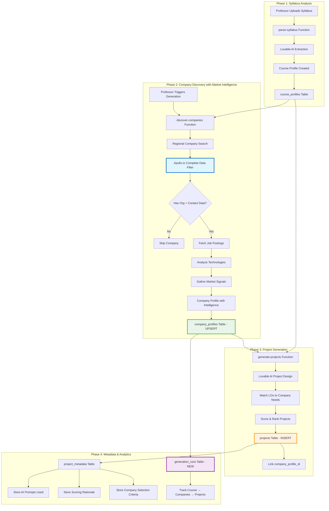

# Syllabus-to-Project Generation Workflow & Data Persistence

## Overview

This document defines the complete workflow for generating projects from syllabi, including company discovery with market intelligence, data persistence strategy, and database population logic for EduThree.

---

## System Architecture



---

## Database Schema Strategy

### 1. **generation_runs** Table (NEW - To Be Created)

**Purpose**: Track every syllabus-to-project generation run with metadata and relationships.

```sql
CREATE TABLE generation_runs (
  id UUID PRIMARY KEY DEFAULT gen_random_uuid(),
  course_id UUID NOT NULL REFERENCES course_profiles(id) ON DELETE CASCADE,
  
  -- Configuration used
  location TEXT,
  industries JSONB,
  specific_companies JSONB,
  num_teams INTEGER NOT NULL,
  
  -- Discovery results
  companies_discovered INTEGER DEFAULT 0,
  companies_enriched INTEGER DEFAULT 0,
  projects_generated INTEGER DEFAULT 0,
  
  -- Processing metadata
  started_at TIMESTAMP WITH TIME ZONE NOT NULL DEFAULT NOW(),
  completed_at TIMESTAMP WITH TIME ZONE,
  status TEXT NOT NULL DEFAULT 'in_progress', -- in_progress, completed, failed
  error_message TEXT,
  
  -- AI usage tracking
  ai_models_used JSONB, -- {"discovery": "gemini-2.5-flash", "generation": "gpt-5-mini"}
  ai_tokens_consumed INTEGER DEFAULT 0,
  
  -- Cost tracking
  apollo_credits_used INTEGER DEFAULT 0,
  processing_time_seconds NUMERIC,
  
  created_at TIMESTAMP WITH TIME ZONE NOT NULL DEFAULT NOW(),
  updated_at TIMESTAMP WITH TIME ZONE NOT NULL DEFAULT NOW()
);

-- Enable RLS
ALTER TABLE generation_runs ENABLE ROW LEVEL SECURITY;

-- RLS Policies
CREATE POLICY "Users can view own generation runs"
  ON generation_runs FOR SELECT
  USING (EXISTS (
    SELECT 1 FROM course_profiles 
    WHERE course_profiles.id = generation_runs.course_id 
    AND course_profiles.owner_id = auth.uid()
  ));

CREATE POLICY "Users can insert generation runs for own courses"
  ON generation_runs FOR INSERT
  WITH CHECK (EXISTS (
    SELECT 1 FROM course_profiles 
    WHERE course_profiles.id = generation_runs.course_id 
    AND course_profiles.owner_id = auth.uid()
  ));

-- Indexes
CREATE INDEX idx_generation_runs_course_id ON generation_runs(course_id);
CREATE INDEX idx_generation_runs_status ON generation_runs(status);
CREATE INDEX idx_generation_runs_created_at ON generation_runs(created_at DESC);
```

---

### 2. **company_profiles** Table (ENHANCED - Update Schema)

**Current State**: Stores basic company data from Google Places + Apollo enrichment  
**Enhancement Needed**: Add market intelligence fields

```sql
-- Add new columns for market intelligence
ALTER TABLE company_profiles ADD COLUMN IF NOT EXISTS job_postings JSONB DEFAULT '[]';
ALTER TABLE company_profiles ADD COLUMN IF NOT EXISTS job_postings_last_fetched TIMESTAMP WITH TIME ZONE;
ALTER TABLE company_profiles ADD COLUMN IF NOT EXISTS technologies_used JSONB DEFAULT '[]';
ALTER TABLE company_profiles ADD COLUMN IF NOT EXISTS buying_intent_signals JSONB DEFAULT '[]';
ALTER TABLE company_profiles ADD COLUMN IF NOT EXISTS funding_stage TEXT;
ALTER TABLE company_profiles ADD COLUMN IF NOT EXISTS total_funding_usd INTEGER;
ALTER TABLE company_profiles ADD COLUMN IF NOT EXISTS discovery_source TEXT; -- 'syllabus_generation', 'manual_enrichment'
ALTER TABLE company_profiles ADD COLUMN IF NOT EXISTS generation_run_id UUID REFERENCES generation_runs(id);
```

**Job Postings Structure**:
```json
{
  "job_postings": [
    {
      "id": "apollo-job-id",
      "title": "Senior Software Engineer",
      "url": "https://company.com/careers/123",
      "city": "Boston",
      "state": "MA",
      "posted_at": "2025-01-15T10:00:00Z",
      "last_seen_at": "2025-01-20T14:30:00Z",
      "skills_needed": ["Python", "React", "PostgreSQL"]
    }
  ]
}
```

**Technologies Used Structure**:
```json
{
  "technologies_used": [
    "Salesforce",
    "SAP",
    "AWS",
    "Docker",
    "PostgreSQL"
  ]
}
```

---

### 3. **projects** Table (CURRENT - Link Enhancement)

**Current State**: Stores generated projects with scoring  
**Enhancement**: Ensure proper linking to generation_run_id

```sql
-- Add generation_run_id tracking
ALTER TABLE projects ADD COLUMN IF NOT EXISTS generation_run_id UUID REFERENCES generation_runs(id);
CREATE INDEX idx_projects_generation_run_id ON projects(generation_run_id);
```

---

### 4. **project_metadata** Table (CURRENT - Enhancement)

**Current State**: Stores AI prompts and scoring rationale  
**Enhancement**: Add market intelligence used in matching

```sql
-- Add market intelligence tracking
ALTER TABLE project_metadata ADD COLUMN IF NOT EXISTS market_signals_used JSONB DEFAULT '{}';
```

**Market Signals Structure**:
```json
{
  "market_signals_used": {
    "job_postings_matched": 3,
    "technologies_aligned": ["Python", "React"],
    "funding_stage": "Series A",
    "hiring_urgency": "high",
    "needs_identified": [
      "Data analytics dashboard",
      "Customer portal automation"
    ]
  }
}
```

---

## Workflow Implementation

### Step 1: Course Profile Creation

**File**: `supabase/functions/parse-syllabus/index.ts`

**Current**: Parses syllabus and creates course_profiles record  
**Enhancement**: None needed - this step is stable

**Output**:
- `course_profiles` record with learning outcomes, level, topics

---

### Step 2: Company Discovery with Market Intelligence

**File**: `supabase/functions/discover-companies/index.ts`

**Current Flow**:
1. AI discovers 4 companies by sector
2. Google Places validates business details
3. Apollo.io enriches with contact data

**Enhanced Flow (TO IMPLEMENT)**:

```typescript
// Step 1: Create generation run record
const { data: generationRun } = await supabase
  .from('generation_runs')
  .insert({
    course_id: courseId,
    location: location,
    industries: industries,
    num_teams: count,
    status: 'in_progress'
  })
  .select()
  .single();

const generationRunId = generationRun.id;

// Step 2: Discover companies (existing logic)
const discoveredCompanies = await discoverCompaniesForCourse(...);

// Step 3: For each discovered company
for (const company of discoveredCompanies) {
  
  // 3a. Fetch Apollo.io organization + contact data
  const apolloOrgData = await fetchApolloOrganization(company.website);
  const apolloContactData = await fetchApolloContact(company.website);
  
  // PRIMARY FILTER: Skip if missing org OR contact data
  if (!isCompleteOrgData(apolloOrgData) || !isCompleteContactData(apolloContactData)) {
    console.log(`Skipping ${company.name} - incomplete Apollo data`);
    continue;
  }
  
  // 3b. Fetch market intelligence
  const jobPostings = await fetchJobPostings(apolloOrgData.id);
  const technologies = apolloOrgData.technologies || [];
  const fundingStage = apolloOrgData.latest_funding_stage;
  
  // 3c. Analyze needs from job postings
  const skillsNeeded = extractSkillsFromJobPostings(jobPostings);
  
  // 3d. UPSERT company profile with ALL data
  const { data: companyProfile } = await supabase
    .from('company_profiles')
    .upsert({
      name: company.name,
      website: apolloOrgData.website_url,
      
      // Contact data (Apollo verified)
      contact_first_name: apolloContactData.first_name,
      contact_last_name: apolloContactData.last_name,
      contact_email: apolloContactData.email,
      contact_title: apolloContactData.title,
      contact_linkedin_url: apolloContactData.linkedin_url,
      
      // Organization data (Apollo verified)
      organization_employee_count: apolloOrgData.estimated_num_employees,
      organization_revenue_range: apolloOrgData.annual_revenue_range,
      organization_logo_url: apolloOrgData.logo_url,
      organization_linkedin_url: apolloOrgData.linkedin_url,
      
      // Market intelligence (NEW)
      job_postings: jobPostings,
      job_postings_last_fetched: new Date().toISOString(),
      technologies_used: technologies,
      funding_stage: fundingStage,
      
      // Metadata
      data_enrichment_level: 'fully_enriched',
      data_completeness_score: calculateCompleteness(apolloOrgData, apolloContactData),
      last_enriched_at: new Date().toISOString(),
      discovery_source: 'syllabus_generation',
      generation_run_id: generationRunId
    }, 
    { 
      onConflict: 'website' // Update if exists
    })
    .select()
    .single();
  
  enrichedCompanies.push(companyProfile);
}

// Step 4: Update generation run stats
await supabase
  .from('generation_runs')
  .update({
    companies_discovered: discoveredCompanies.length,
    companies_enriched: enrichedCompanies.length
  })
  .eq('id', generationRunId);

return enrichedCompanies;
```

---

### Step 3: Project Generation with Need Matching

**File**: `supabase/functions/generate-projects/index.ts`

**Enhanced Flow (TO IMPLEMENT)**:

```typescript
// For each company with market intelligence
for (const company of enrichedCompanies) {
  
  // Extract company needs from market signals
  const companyNeeds = {
    skillsGaps: extractSkillsFromJobPostings(company.job_postings),
    technicalCapabilities: company.technologies_used,
    fundingCapacity: company.funding_stage,
    hiringUrgency: calculateHiringUrgency(company.job_postings)
  };
  
  // Generate project with AI, using market intelligence
  const systemPrompt = `
    You are generating a real-world project for university students.
    
    Company Context:
    - Name: ${company.name}
    - Industry: ${company.sector}
    - Size: ${company.organization_employee_count} employees
    - Technologies: ${company.technologies_used.join(', ')}
    - Active Job Postings: ${company.job_postings.length}
    - Skills They Need: ${companyNeeds.skillsGaps.join(', ')}
    
    Course Learning Outcomes:
    ${courseOutcomes.map((lo, i) => `${i+1}. ${lo}`).join('\n')}
    
    Generate a project that:
    1. Addresses their REAL skills gaps (from job postings)
    2. Aligns with their tech stack (${company.technologies_used.join(', ')})
    3. Covers the course learning outcomes
    4. Is feasible for ${teamSize} students in ${durationWeeks} weeks
  `;
  
  const aiResponse = await callLovableAI(systemPrompt);
  const project = parseProjectFromAI(aiResponse);
  
  // Insert project with company link
  const { data: insertedProject } = await supabase
    .from('projects')
    .insert({
      ...project,
      course_id: courseId,
      company_profile_id: company.id,
      generation_run_id: generationRunId
    })
    .select()
    .single();
  
  // Insert metadata with market signals
  await supabase
    .from('project_metadata')
    .insert({
      project_id: insertedProject.id,
      ai_model_version: 'google/gemini-2.5-flash',
      market_signals_used: {
        job_postings_matched: company.job_postings.length,
        technologies_aligned: companyNeeds.technicalCapabilities,
        funding_stage: company.funding_stage,
        skills_needed: companyNeeds.skillsGaps
      }
    });
}

// Update generation run with final stats
await supabase
  .from('generation_runs')
  .update({
    projects_generated: generatedProjects.length,
    completed_at: new Date().toISOString(),
    status: 'completed',
    processing_time_seconds: (Date.now() - startTime) / 1000
  })
  .eq('id', generationRunId);
```

---

## Data Persistence Rules

### UPSERT Logic for Companies

**Rule**: Use `website` as the unique identifier for company profiles

```typescript
// When discovering/enriching companies
await supabase
  .from('company_profiles')
  .upsert(
    {
      website: companyWebsite,
      name: companyName,
      // ... all other fields
    },
    { 
      onConflict: 'website',
      // Only update if new data is more complete
      ignoreDuplicates: false
    }
  );
```

**Update Strategy**:
- If company exists with `data_enrichment_level = 'basic'` → **UPDATE** with Apollo data
- If company exists with `data_enrichment_level = 'fully_enriched'` → **SKIP** (already enriched)
- If market intelligence data is >90 days old → **REFRESH** job postings only

---

### Project-Company Linking

**Rule**: Every project MUST link to a company_profile

```sql
-- Projects table constraint
ALTER TABLE projects 
  ADD CONSTRAINT fk_company_profile 
  FOREIGN KEY (company_profile_id) 
  REFERENCES company_profiles(id) 
  ON DELETE SET NULL;
```

**Enforcement**:
- `generate-projects` function MUST NOT create projects without `company_profile_id`
- UI displays "Company Not Found" if link is broken

---

### Generation Run Tracking

**Rule**: Track every generation attempt, even failures

```typescript
// On generation start
const runId = await createGenerationRun(courseId, config);

try {
  // ... discovery and generation logic
  
  await markGenerationComplete(runId, stats);
} catch (error) {
  await markGenerationFailed(runId, error.message);
  throw error;
}
```

---

## API Endpoints

### 1. Trigger Company Discovery & Enrichment

**Endpoint**: `POST /functions/v1/discover-companies`

**Request**:
```json
{
  "courseId": "uuid",
  "location": "Boston, MA",
  "industries": ["Technology", "Healthcare"],
  "count": 4
}
```

**Response**:
```json
{
  "success": true,
  "companies": [...],
  "count": 4,
  "generation_run_id": "uuid",
  "stats": {
    "discovered": 12,
    "enriched": 4,
    "processing_time_seconds": 18.5,
    "apollo_credits_used": 4
  }
}
```

---

### 2. Check Generation Status

**Endpoint**: `GET /functions/v1/generation-status?runId=uuid`

**Response**:
```json
{
  "status": "completed",
  "companies_discovered": 12,
  "companies_enriched": 4,
  "projects_generated": 4,
  "processing_time_seconds": 18.5,
  "apollo_credits_used": 4
}
```

---

### 3. Fetch Projects for Course

**Endpoint**: `GET /rest/v1/projects?course_id=eq.{courseId}`

**Enhancement**: Include company profile data

```typescript
const { data: projects } = await supabase
  .from('projects')
  .select(`
    *,
    company_profile:company_profiles(
      name,
      website,
      organization_logo_url,
      organization_employee_count,
      data_completeness_score,
      job_postings
    )
  `)
  .eq('course_id', courseId)
  .order('final_score', { ascending: false });
```

---

## Analytics & Reporting

### Generation Run Analytics

```sql
-- Success rate by course
SELECT 
  c.title,
  COUNT(*) as total_runs,
  SUM(CASE WHEN gr.status = 'completed' THEN 1 ELSE 0 END) as successful_runs,
  AVG(gr.processing_time_seconds) as avg_processing_time,
  AVG(gr.companies_enriched) as avg_companies_enriched
FROM generation_runs gr
JOIN course_profiles c ON gr.course_id = c.id
GROUP BY c.id, c.title;
```

### Company Data Quality

```sql
-- Companies by enrichment level
SELECT 
  data_enrichment_level,
  COUNT(*) as count,
  AVG(data_completeness_score) as avg_completeness
FROM company_profiles
GROUP BY data_enrichment_level;
```

### Market Intelligence Coverage

```sql
-- Companies with job postings
SELECT 
  COUNT(*) FILTER (WHERE jsonb_array_length(job_postings) > 0) as with_job_postings,
  COUNT(*) FILTER (WHERE jsonb_array_length(technologies_used) > 0) as with_technologies,
  COUNT(*) as total_companies
FROM company_profiles
WHERE data_enrichment_level = 'fully_enriched';
```

---

## Migration Plan

### Phase 1: Create generation_runs Table
- Run migration to create table + indexes + RLS policies
- No breaking changes to existing functionality

### Phase 2: Add Market Intelligence Fields to company_profiles
- Add new columns (nullable, with defaults)
- No breaking changes - existing data remains valid

### Phase 3: Update discover-companies Function
- Add generation run tracking
- Add market intelligence fetching (job postings, technologies)
- Maintain backward compatibility

### Phase 4: Update generate-projects Function
- Add market intelligence to AI prompts
- Add metadata tracking
- Link projects to generation runs

### Phase 5: UI Enhancements
- Show generation run history on course page
- Display market intelligence in company profiles
- Add "Regenerate with New Data" option

---

## Best Practices

### 1. Data Freshness
- Job postings: Refresh every 30 days
- Contact data: Refresh every 90 days
- Company profile: Refresh every 180 days

### 2. Error Handling
- Log all Apollo.io API failures with company name
- Gracefully degrade if market intelligence unavailable
- Continue generation even if 1-2 companies fail

### 3. Cost Optimization
- Check database before calling Apollo.io API
- Batch Apollo requests when possible
- Track credit usage per generation run

### 4. Performance
- Target: <20 seconds per course generation
- Parallelize Apollo.io calls when possible
- Cache frequently accessed company data

---

## Security Considerations

### 1. Data Privacy
- Contact data stored encrypted at rest
- Never expose raw contact data in frontend
- Apollo.io data usage complies with TOS

### 2. Access Control
- RLS policies enforce professor can only see own courses
- Generation runs linked to course ownership
- Company data readable by all authenticated users

### 3. Rate Limiting
- Limit professors to 10 generation runs per day
- Prevent abuse of Apollo.io API credits
- Monitor for unusual usage patterns

---

## Future Enhancements

### 1. Background Enrichment
- Auto-refresh stale company data nightly
- Proactive job postings monitoring
- Alert professors when new opportunities arise

### 2. Smart Company Recommendations
- ML model to predict best company-course matches
- Historical success rate analysis
- Industry trend integration

### 3. Collaborative Features
- Share enriched company database across professors
- Crowd-sourced company reviews
- Partnership success tracking

---

## Conclusion

This workflow ensures:
- ✅ Every generation run is tracked and auditable
- ✅ Companies are enriched with market intelligence
- ✅ Projects are linked to real company needs
- ✅ Data quality improves over time through UPSERT logic
- ✅ Professors get actionable, verified company matches
